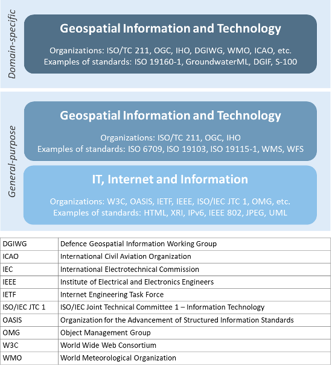
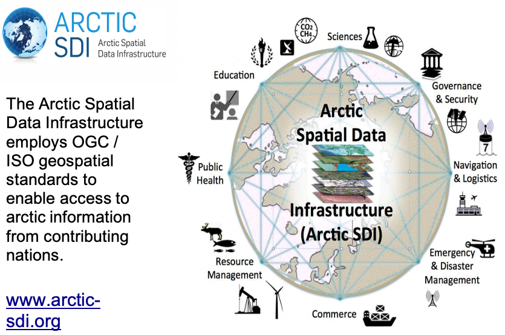
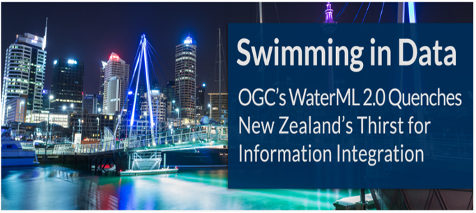
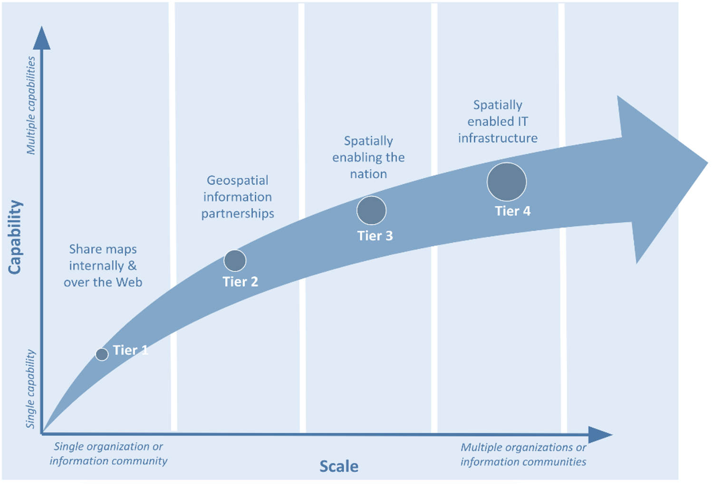
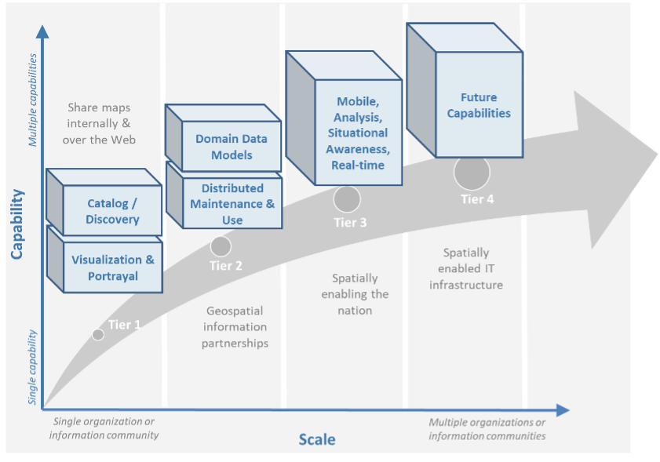

[[direction_setting]]
:numbered:
== Direction Setting
:!numbered:

|===
| The purpose of this section is enabling the reader to: +
 * Understand the benefits of standards and the importance of setting strategic goals to achieve increasing levels of geospatial maturity. +
 * Identify the types of standards required for increasing levels of capability and scale of collaboration. +
 * Understand the role of standards development organizations (SDOs) and how to participate in standards development. +
 * Understand the different types of standards and how they contribute to interoperability, and examples of benefits.
|===

=== Standards Awareness

When undertaking a leadership role on geospatial standards, it is important to understand the practical use of standards and to raise awareness of the benefits of moving towards a standards-based approach for geospatial data management at all levels of government, the private sector and academia.
footnote:[UN GGIM Integrated Geospatial Information Framework (IGIF) - Strategic Pathway 6 (SP6), http://ggim.un.org/IGIF/part2.cshtml] When it comes to the implementation of standards, benefits include:

* Reducing cost over the lifecycle of a system or systems.
* Ensuring the ability to share data when appropriate, with respect for privacy issues.
* Enabling interoperability among systems.
* Enabling interoperable sharing and operations.
* Enabling innovation by facilitating rapid mobilization of new technologies and data sources.
* Supporting disconnected or local operations.

_Interoperability_ is the ability to access, exchange, integrate and cooperatively use data in a coordinated manner, within and across organizational, regional, and national boundaries.footnote:[What is Interoperability? https://www.himss.org/resources/interoperability-healthcare] As described in IGIF SP6, technology and data interoperability enables different technologies, systems, and geospatial data to work together seamlessly, and provides the flexibility to rapidly mobilize newer technologies and data sources.

==== What are Standards and Why are They Important?

A standard is a documented agreement between provider and consumers, established by consensus, that provides rules, guidelines, or characteristics ensuring materials, products, and services are fit for purpose. Behind the scenes, standards make everyday life work. They may establish size or shape or capacity of a product, process, or system. They can specify performance of products or personnel. They can also define terms so that there is no misunderstanding among those using the standard.

==== Standards Save Time, Money, and Lives

[#figure1_1]
.Aftermath of the 1904 Great Baltimore Fire (source: Wikipedia)

In 1904, much of the City of Baltimore in the United States was destroyed by a massive fire. Firefighters from hundreds of kilometers away were sent to assist Baltimore firefighters during the height of the blaze. They could do little to help because the fire hose size and threads used by different responders were not standardized for compatibility with Baltimore fire hydrants footnote:[http://tsapps.nist.gov/publication/get_pdf.cfm?pub_id=101300]. The resultant inability to connect hoses to fire hydrants turned hundreds of firefighters into spectators. This analogy rings true not just in respect of the need to share geospatial information, such as disaster imagery, during a crisis but throughout all implementations of geospatial technologies. Standards make uniformity, compatibility, and interoperability possible for electronic devices, software applications, and processes in all sectors of a global economy.

Without standards, the ability to connect systems, data, people, hardware, software, and procedures becomes difficult and inefficient. Loss of time, assets and lives is inevitable.

A recent example of the value of standards was brought to the surface by the COVID-19 pandemic. Addresses provide one of the most common and unambiguous ways to identify and locate objects, and assist services such as postal delivery, emergency response, marketing, mapping, utility planning and land administration. Addresses and address data turned out to be crucial in the fight against COVID-19 because they enabled contact tracing and identification of cluster outbreaks. Non-standardized addresses significantly hinder the response to COVID-19. The multi-part International Organization for Standardization (ISO) 19160 Addressing Standard supports a variety of stakeholders so that accurate and reliable address data can be made available. The different parts of ISO 19160 cover topics such as terminology and a conceptual data model for addressing; good practices for address assignment and maintenance; quality of address data; and international postal addressing (jointly developed with the Universal Postal Union).

==== The Case for Open Standards

Open standards facilitate interoperability and data exchange among different products or services intended for widespread adoption. Standards and specifications define requirements to ensure that products and data are consistent in accuracy, structure, format, style, and content.
footnote:[adapted from https://www.usgs.gov/core-science-systems/ngp/ss/product-standards] Standards development is a process that requires consensus among stakeholders. Open standards are a central element in the growing trend towards effective government.

*Open international standards* are voluntary consensus-driven standards published by the SDOs. Open standards
footnote:[Open does not necessarily imply free of cost. Depending on a SDO’s business model, costs of developing standards are recovered from membership fees or sales.] are developed, approved, and maintained via a collaborative and consensus-driven process and made available to the general public. These standards are aimed at achieving legal, data, semantic and/or technical interoperability. Furthermore, open standards offer users the opportunity to have a voice in building and learning about the standards. Apart from standards, the SDOs offer other types of open documents and services, such as specifications and reports, to respond to urgent market needs or to address work still under technical development.

The main focus of the IGIF SP6 and this Guide is on open international geospatial standards. However, other means of information sharing that may lead to or supplement standards are also described in this subsection:

*Specifications* generally offer an interoperability solution similar to that of standards, but are not necessarily developed in the same voluntary, consensus-based process. Specifications may precede or contribute to the body of knowledge for new open standards, thus serving a meaningful role in furthering innovation in the geospatial industry.
footnote:[Specifications may be industry or community developed. Industry-driven specifications typically start as closed or proprietary based on their intellectual property value and a company’s investment in research and development. Some owners of closed specifications make open libraries available for others to read and right, providing a level of openness. As specifications mature, some are released through open licenses to the community as open specifications. Some International and Community standards begin as industry developed open specifications and de facto standards.] In the case of the OGC, output from the OGC Innovation Program initiatives may result in draft specifications for consideration for development as a standard. Further, open standards or specifications developed externally to the OGC may submitted to the OGC to become formally endorsed as OGC *community standards*.footnote:[A Community standard is an official position of the OGC endorsing a specification or standard developed external to the OGC and is considered a normative standard by OGC membership and part of the OGC Standards Baseline. Examples of open specifications that have achieved OGC Community Standard status include the OGC 3D Tiles Specification and OGC Indexed 3d Scene Layer (I3S) and Scene Layer Package Format Specification. https://www.ogc.org/standards/community]

Based on international standards, *profiles* may be established and endorsed by governance bodies to meet the specific needs of their country or organization. Metadata profiles, such as the https://inspire.ec.europa.eu/id/document/tg/metadata-iso19139[_INSPIRE dataset and service metadata_, window="_blank"], and the https://committee.iso.org/sites/tc211/home/standards-in-action/user-story-challenge/paigh---latin-american-metadata.html[_Latin American Metadata Profile LAMP version 2 (LAMPv2)_, window="_blank"] are examples of profiles based on international standards.

*Good practices* describe how an open standard is applied against scenarios or define a profile that tailors it to the requirements of a specific community. Good practices (also referred to as best or proven practices) often highlight the practical use of one or more standards and specifications or address particular use cases. They may relate to implementing tools and techniques, emerging technologies and standards, or extensions/profiles for specific application domains.
footnote:[Examples of endorsed Good Practices include the Defence Geospatial Information Working Group (DGIWG) Comm/TIFF Profile for Imagery & Gridded Data 2.3.1 (OGC Best Practices https://www.ogc.org/docs/bp ) and INSPIRE Good Practice: SDMX for Human Health and Population Distribution (INSPIRE Good Practices https://inspire.ec.europa.eu/portfolio/good-practice-library )]

Over time and with broad adoption, a specification may be so widely used that the community considers it a *de facto standard* for a given application, even if it was not assigned an official status by a governance body. Developers should be aware that some de facto standards require proprietary solutions to be licensed in order to implement them. De facto standards should balance interoperability, access, and use requirements and be used in parallel with open international or national standards when possible.footnote:[De facto standards can be endorsed as international standards over time, for example, HTML, PDF, and GeoJSON have followed this route  https://whatis.techtarget.com/definition/de-facto-standard and https://www.ogc.org/blog/2543]

Closed standards or specifications carry risks that may pose hidden challenges such as delays and costs of expanding or adapting data and software tools to work with other resources, software, or organizations. Organizations should be aware of the potential risk to interoperability of closed standards or specifications and consider these risks on balance with the benefits. Open standards and specifications, on the other hand, help organizations best balance their needs while minimizing business and technology risks.

In an ever-changing world, open standards help assure that organizations can more quickly take advantage of new geospatial information sources and new technology tools. International standards developed and maintained by the consensus processes of recognized SDOs help avoid risk by broadly addressing and managing community requirements for interoperability, access, and use.

==== The Benefits of Open Geospatial Standards

Geospatial information, technologies, and standards help enable and improve the sharing, integration, and application of geospatial information for decision making. While national governments can make proactive policy choices to maximize benefits, other jurisdictions and enterprises must align with this policy to achieve mutually optimal outcomes.

A multi-national response to a regional disaster is one example where having clear policy on the sharing of geospatial information is critically important. The shaping of appropriate geospatial policy is beyond the mandate of this Guide (See http://ggim.un.org/IGIF/part2.cshtml[IGIF SP2, window="_blank"]), but it must be addressed. For without a suitable policy framework the standards-based approaches described in this Guide will be of limited value.

The remainder of this Guide seeks to answer the following questions directly related to the role of standards in geospatial information management:

* What are the common standards adopted by organizations worldwide?
* Which of these standards are appropriate for geospatial information management in the context of the UN initiative on Global Geospatial Information Management?
* What are the appropriate geospatial standards for an organization's needs?

In addition to these questions the overall value proposition associated with open standards should be considered by all stakeholders. The fundamental questions include quantifying the benefits, examining the reduction of related risks, as well as the potential for improved productivity and new opportunities.

==== Examples of Quantitative Benefits

Open standards facilitate increased return on geospatial investment through a host of mechanisms. Return on investment may be realized through direct means such as improved efficiency, from saved time and effort, or through the ability to rapidly mobilize new capabilities. The following examples demonstrate the monetary benefits of standardization:

* The German Institute for Standardization (DIN) estimated benefits of 17 billion euros to the German economy in 2010: "Standards promote worldwide trade, encouraging rationalization, quality assurance and environmental protection, as well as improving security and communication. Standards have a greater effect on economic growth than patents or licenses."
footnote:[See DIN, “"Economic Benefits of Standardization," 2010, at http://www.din.de/sixcms_upload/media/2896/DIN_GNN_2011_engl_akt_neu.pdf]
* The Joint Research Centre of the European Union collaborated with the Universitat Politècnica de Catalunya (Spain) in concluding that the establishment of the Spatial Data Infrastructure (SDI) of Catalonia -- based on open geospatial standards -- generated significant internal efficiency benefits as well as benefits of more effective service delivery. They quantified these benefits and estimated that the value exceeded four year's investment in just over six months.
footnote:[See Craglia M. (Ed.), “The Socio-Economic Impact of the Spatial Data Infrastructure of Catalonia,” 2008, at http://publications.jrc.ec.europa.eu/repository/handle/111111111/7696]
* Of the projects considered in a NASA Geospatial Interoperability Return on Investment Study, the project that adopted and implemented geospatial interoperability standards had a risk-adjusted ROI of 119.0%. This ROI is a "Savings to Investment" ratio. This can be interpreted as for every $1.00 spent on investment, $1.19 is saved on Operations and Maintenance costs. Overall, the project that adopted and implemented geospatial interoperability standards saved 26.2% compared to the project that relied upon a proprietary standard. One way to interpret this result is that for every $4.00 spent on projects based on proprietary platforms, the same value could be achieved with $3.00 if the project were based on open standards.
footnote:[NASA Geospatial Interoperability Return on Investment Study (2005) http://www.ec- gis.org/sdi/ws/costbenefit2006/reference/ROI_Study.pdf]
* New Zealand SDI Benefits: Spatial Information in the New Zealand Economy - Realizing Productivity Gains is a report commissioned by Land Information New Zealand, the Department of Conservation, and the Ministry of Economic Development. It provides robust economic analysis that quantifies the contribution spatial information makes to the New Zealand economy, as well as opportunities for this contribution to grow. The report concludes that use and re-use of spatial information is estimated to have added $1.2 billion in productivity related benefits to the New Zealand economy in 2008.
footnote:[New Zealand http://www.linz.govt.nz/geospatial-office/about/projects-and-news/productivityreport]
* The Global Geospatial Industry Outlook (2019), published by Geospatial Media and Communications, valued the global geospatial industry at an estimated US$ 339.0 billion in 2018. The cumulative geospatial industry is projected to reach US$ 439.2 billion by 2020, growing at a compound annual growth rate of 13.8%. This growth acceleration can be accredited to continuous technology advancements in the industry, democratization of geospatial information riding on integration with advancements in digital technologies and resultant innovative business models. Adopting open standards is considered to be important for the way forward and for realizing the full potential of geospatial technologies.
* In 2019, the Singapore government announced a Marine Spatial Data Infrastructure (MSDI) called " https://ihr.iho.int/articles/singapores-national-marine-spatial-data-infrastructure-geospace-sea-enabling-hydrospatial-context/[GeoSpace-Sea, window="_blank"]". Focused on data harmonization and interoperability standards, GeoSpace-Sea is designed to bridge the land/sea information gap and enable interdisciplinary marine coastal applications for the Singapore government. The establishment of a national MSDI will help provide environmental, social, and economic benefits to Singapore. For instance, the maritime industry, which contributes 7% of Singapore's Gross Domestic Product (GDP), and the aquaculture industry will benefit from GeoSpace-Sea through increased efficiency, safety, and sustainability.

===== Key Types of Geospatial Standards

There are several different ways in which standards for geographic information can be categorized or characterized. The IGIF SP 6 refers to three general types of standards:

* Domain-specific standards
* General-purpose standards for geospatial information and technology specifically
* General-purpose standards for information technologies and the internet generally.

Examples of standards for each of these types are found in Sections 2 and 4 of this Guide.

Some standards serve as general-purpose IT standards. For example, the http://www.uml.org/[_Unified Modeling Language (UML)_, window="_blank"], developed and published by the Object Management Group (OMG) and ISO/IEC JTC 1, can be used for "specifying, visualizing, constructing, and documenting the artifacts of software systems, and for business modeling". It is not specific to geospatial information and technologies. https://www.iso.org/standard/56734.html[_ISO 19103, Geographic information -- Conceptual schema language_, window="_blank"], is a profile footnote:[A profile may be a locally recommended subset of a standard and/or locally relevant domain lists to be used with a particular standard, such as a list of metadata keywords.] of UML for the special case of describing geographic information. It is not specific to any domain or context and therefore also has a general purpose in the context of geospatial information and technologies. The general-purpose standards are also referred to as "foundational" standards because they form the technological basis for geospatial information exchange (see <<figure1_2,Figure 1.2>>).

Other standards describe geographic information related to a specific domain or context. Standards, such as the Open Geospatial Consortium (OGC) http://www.ogc.org/standards/gwml2[_Groundwater Markup Language (GroundwaterML)_, window="_blank"], http://www.iso.org/standard/61710.html[_ISO 19160-1 Addressing -- Part 1: Conceptual model_, window="_blank"], and http://www.iso.org/standard/51206.html[_ISO 19152 Geographic information - Land Administration Domain Model (LADM)_, window="_blank"] make use of the general-purpose http://www.iso.org/standard/56734.html[_ISO 19103 Geographic information -- Conceptual schema language_, window="_blank"] to describe geographic information related to ground water, addressing and land administration respectively.

[#figure1_2]
.Characterization of general-purpose IT and geospatial standards, and domain-specific geospatial standards.

Geospatial standards can be further characterized based on one of three standardization targetsfootnote:[The reference model for geographic information standardization (ISO 19101-1, Geographic information -- Reference model -- Part 1: Fundamentals, also available as the OGC Abstract Specification)]:

. Information (or content) standards
. Service or interface standards
. Procedural standards.

A specific standard is not necessarily aimed at a single standardization target. Sometimes information, services and procedures are grouped into a single standard for a specific domain. For example, http://www.iso.org/standard/54759.html[_ISO 19147, Geographic information -- Transfer Nodes_, window="_blank"] defines both transfer node information relevant for travel planning and modelling of interoperable transport systems, as well as a set of services related to transfer nodes.

Therefore, these characterizations are important when deciding which standard to use and are described in more detail below:

*Information standards* address heterogeneity at the semantic, structural, and syntactic level, i.e., they standardize the meaning of information (e.g., by defining concepts), how it is structured (e.g., through a conceptual model) and how it is encoded (e.g., a standardized digital encoding). Examples include http://www.ogc.org/standards/gwml2[_OGC GroundwaterML_]_,_ http://www.iso.org/standard/53798.html[_ISO 19115-1, Geographic information -- Metadata -- Part 1_]_: Fundamentals_ and http://www.iso.org/standard/61710.html[_ISO 19160-1, Addressing -- Part 1: Conceptual model_, window="_blank"].

[#figure1_3]
.International cooperation on Arctic issues through OGC / ISO standards-based SDI and Portal

*Service or interface standards* define the rules for interacting with services and components in order to discover, access or process geographic information. Examples include the http://www.ogc.org/standards/wms[_OGC Web Mapping Service (WMS)_] _(also_ http://www.iso.org/standard/32546.html[_ISO 19128_]_)_, http://www.ogc.org/standards/wfs[_OGC Web Feature Service (WFS)_] (also http://www.iso.org/standard/42136.html[ISO 19142]) and http://www.iso.org/standard/40601.html[_ISO 19132, Geographic information - Location-based services - Reference model_, window="_blank"]. Ideally, when standards are implemented in products or online services the resulting components work together seamlessly.

*Procedural standards* describe an ordered series of steps to accomplish a specific task. Examples include http://www.iso.org/standard/32576.html[_ISO/TS 19158, Geographic information - Quality assurance of data supply_, window="_blank"], and http://www.iso.org/standard/54721.html[_ISO 19135-1 Geographic Information - Procedures for item registration - Part 1: Fundamentals_, window="_blank"]. Together, these standards allow different systems and applications to communicate and work together.

When selecting *Interoperability standards*, one needs to know which kind of interoperability footnote:[ISO 19101-1:2014, Geographic information -- Reference model -- Part 1: Fundamentals] can be achieved by its implementation.

* *System interoperability* is achieved if hardware, operating systems, and communication systems are able to communicate and work together, e.g. by standards such as http://tools.ietf.org/html/rfc2460[_IETF IPv6_, window="_blank"] and http://www.ieee802.org/[_IEEE 802_, window="_blank"].
* *Syntactic interoperability* is achieved if different systems, applications, or services can exchange information via a common encoding, such as http://tools.ietf.org/html/rfc7946[_GeoJSON_, window="_blank"] or the shapefile format.
* *Structural interoperability* is achieved if systems, applications, or services can exchange information through a common conceptual model or the mapping from one model to another. This addresses heterogeneity in structure, e.g., a street can be represented as an object of the type 'Street' or by a generic geospatial object whose attribute (or tag or property) has the value 'street'.
* *Semantic interoperability* is achieved when the differences in language, cultural and domain meanings between concepts and data representing reality are eliminated. These differences arise from the various perspectives and contexts from which real-world phenomena are abstracted. Between organizations, and even within the same organization, the terminology for a particular phenomenon may have many meanings and contexts. For example, depending on the context, a "bridge" can be an element of a road infrastructure, a platform of a ship, an obstacle in marine navigation, or a point of interest for tourists. Another example, a 'tower' can be a communication facility, a navigation landmark, and an aeronautical obstacle.

___Semantics___, in the context of this Guide, refers to the meaning of words, terms and concepts related to geospatial information. Semantic interoperability is an important part of standardization at national, international, and local levels. For information to flow among jurisdictions and organizations, it is essential that all parties agree on the meaning or intent of what the information represents. Through the semantic mediation process, national data can be combined with common meanings to address regional topics that transcend national boundaries.

==== How are Standards Implemented?

Depending on how they are used, standards can be grouped into meta and application (or instance) level standards:

* *Meta level* standards will typically not be implemented at the country level yet are required for the development of other standards. It is important to know that these standards exist and understand their role in standardization. Examples include http://www.iso.org/standard/63541.html[_ISO 19104, Geographic information -- Terminology_, window="_blank"], and http://www.iso.org/standard/26010.html[_ISO 19105, Geographic information -- Conformance and testing_, window="_blank"],

[#figure1_4]
.Using OGC WaterML and OGC/ISO application-level web services standards, New Zealand created an integrated national water resource system from 16 separate regional catchment authorities.   www.ogc.org/blog/3285

* *Application level* standards are directly implementable, such as metadata standards (e.g., http://www.iso.org/standard/53798.html[_ISO 19115-1_, window="_blank"]), ontologies for a specific domain or implementation (e.g., http://www.ogc.org/standards/waterml[_OGC WaterML_, window="_blank"] or http://www.iso.org/standard/61710.html[_ISO 19160-1, Addressing - Part 1: Conceptual model_, window="_blank"]) or service specifications (e.g. http://www.ogc.org/standards/wms[_OGC WMS_, window="_blank"] and http://www.ogc.org/standards/wfs[_OGC WFS_, window="_blank"]). Countries often develop their own profiles (specializations) of international application-level standards (e.g., the http://inspire.ec.europa.eu/metadata/6541[Infrastructure for Spatial Information in the European Community (INSPIRE) Metadata, window="_blank"]),
* *Instance level* standards refer to the implementations of standardized data, services, or procedures. Examples would be the standardized geospatial datasets that are made available as part of a national SDI.

==== SDOs for Geospatial Information

The majority of international standards are developed in SDOs that use a consensus process guided by documented, repeatable and well proven policies and procedures. This helps ensure that the standards developed meet the needs of all users.

The three international organizations that participated in the development of this document share the objective of developing standards for geospatial information:

* The ISO Technical Committee 211 Geographic information/Geomatics ( https://www.iso.org/committee/54904.html[ISO TC/211, window="_blank"])
* The Open Geospatial Consortium ( https://ogc.org/[OGC, window="_blank"])
* The International Hydrographic Organization ( https://iho.int/[IHO]).

Additionally, the World Wide Web Consortium ( https://www.w3.org/[W3C, window="_blank"]) and Internet Engineering Task Force ( https://www.ietf.org/[IETF, window="_blank"]) are examples of two SDOs that develop foundational standards which are increasingly important in contemporary geospatial applications based upon internet and web technologies. Amongst others, the American Society for Photogrammetry ( http://www.asprs.org/[ASPRS, window="_blank"]) and the Geospatial and Remote Sensing Society ( http://www.grss-ieee.org/[GRSS, window="_blank"]) of the Institute of Electrical and Electronic Engineers also play roles in geospatial standards development.

These international standards organizations have representative members from government, industry, research, non-government organizations and academia who arrive at decisions through a consensual process. The organizations develop, maintain, and make publicly available open standards that facilitate the ability to publish, discover, access, manage and use geospatial information across a range of applications, systems, and business enterprises.

==== The Benefits of Joining an SDO

To take advantage of emerging standards and trends, countries and organizations can leverage the global resources of groups such as the UN-GGIM, SDOs, and other major associations mentioned in this document to identify trends and to adopt good practices.

Organizations participate in standards development work of OGC, ISO/TC 211 and IHO to understand implications and assure earliest implementation of standards that will help ease integration of new technologies and data sources. Manyfold benefits can be achieved by formally joining or informally participating in an SDO. These benefits include:

* Access to communities of experts to gain and share knowledge.
* The ability to influence the development of international standards.
* Opportunity to access and contribute to innovative new technologies, with potential funding programs.
* Gaining insight into emerging new technology trends and how standards emerge around them.
* Trusted advice - regulators can rely on standards as a solid base on which to create public policy.
* Forging international partnerships for government and academia.
* Building capacity via formal training and development programs.
* Contributing to the UN Sustainable Development Goals.

At a minimum, organizations and institutions should consider providing their interoperability requirements to the OGC, ISO, and/or IHO. This does not require much time but ensures that these requirements are documented and considered in the ongoing development of international standards.

The Open Geospatial Consortium (OGC) is an international consortium of geospatial experts from more than 500 businesses, government agencies, research organizations, and universities driven to make geospatial (location) information and services FAIR - Findable, Accessible, Interoperable, and Reusable. OGC's member-driven consensus process creates https://www.ogc.org/docs/is[] https://www.ogc.org/docs/is[royalty free, freely available, open geospatial standards, window="_blank"]. OGC actively analyzes and anticipates emerging https://www.ogc.org/ogctechtrends[] https://www.ogc.org/ogctechtrends[tech trends, window="_blank"], and runs an agile, collaborative Research and Development (R&D) lab - the https://www.ogc.org/ogc/programs/ip[OGC Innovation Program, window="_blank"] - that builds, tests and prototypes candidate standards to address community challenges. Membership details and benefits can be found at https://www.ogc.org/ogc/benefits[https://www.ogc.org/ogc/benefits, window="_blank"]

The http://www.iso.org/committee/54904.html[ISO, window="_blank"] is a global network of national standards bodies. Members are the foremost standards organizations in their countries and there is only one member per country. Each member represents ISO in its country. Individuals or companies cannot become ISO members, but there are ways that you can https://www.iso.org/get-involved.html[] https://www.iso.org/get-involved.html[take part in standardization work, window="_blank"], either through a national standards body (the member), or by becoming a liaison organization to an ISO committee, in the case of geographic information, this is ISO TC/211. Specific details can be found at https://committee.iso.org/home/tc211[https://committee.iso.org/home/tc211, window="_blank"]

The https://iho.int/en/become-a-member-state[IHO, window="_blank"] is the inter-governmental technical and consultative organization that sets global standards for hydrography and nautical charting and provides global coordination and support for the world's national hydrographic services. It is a recurring recommendation of the General Assembly of the UN and of the International Maritime Organization (IMO), that every coastal State should be a member of the IHO in order to meet its international obligations while maximizing the national economic benefits that accrue from a comprehensive national hydrographic program. More details can be found at https://iho.int/en/become-a-member-state[https://iho.int/en/become-a-member-state, window="_blank"]

The http://www.w3.org/[W3C, window="_blank"] is an international community where Member organizations, a full-time https://www.w3.org/People/[staff, window="_blank"], and the public work together to develop Web standards. More details can be found at https://www.w3.org/[https://www.w3.org/, window="_blank"]

For further information on how to become a member or participate with these organizations please see their respective websites.

=== Emerging Standards and Trends

Standards continuously adapt to changes in technologies and other developments. On a regular basis, the UN-GGIM reviews and publishes https://ggim.un.org/meetings/GGIM-committee/10th-Session/documents/Future_Trends_Report_THIRD_EDITION_digital_accessible.pdf[a five to ten year vision on future trends in geospatial information management, window="_blank"]. In the most recent version, the top five geospatial industry drivers predicted to have the greatest impact on geospatial information management over the next 5 to 10 years were identified: the rise of new data sources & analytical methods; technological advancements; evolution of user requirements; industry structural shift; and legislative environment. More specifically related to standardization, the Trends provide a forecast of technologies and related geospatial standardization requirements. Amongst others, a mind map of emerging trends, grouping and road map of synergetic trends and a summary chart of Priority Tech Trends are reviewed and published regularly. These documents should be read in the more general context of the importance of geospatial information management to international http://sdgs.un.org/goals[Sustainable Development Goals (SDGs), window="_blank"], as discussed in Monitoring Sustainable Development Contribution of Geospatial Information to the Rio+20 process.

The market is delivering technology advancements on a continual basis. Many of these advancements will help to further improve organizational decision making and reduce cost and effort associated with IT infrastructure. Organizational leadership must be prepared to take advantage of key technology advancements when they become widely available.

=== Strategy for Standards Implementation

==== Tiers: A Goal-based Approach to Implementation

Organizations, institutions, and information communities are likely to be starting their standards journey at different points in the capability/maturity continuum, requiring a phased implementation approach that considers the different levels of experience and expertise of the people involved. footnote:[UN GGIM Integrated Geospatial Information Framework (IGIF) - Strategic Pathway 6 (SP6)] Collaborative initiatives to share and deliver geospatial information are typically oriented around SDI initiatives.

Standards for geospatial information can be seen as a continuum, enabling the achievement of increasing levels of interoperability of geospatial information as more standards are adopted and adapted to keep pace with evolving requirements, technologies, and tools.

Reaping the benefits of standards adoption is a journey and organizations, institutions and information communities are likely to be starting this journey at different points in the capability/maturity continuum. This guide provides a model for the phased implementation of geospatial standards that considers the different levels of experience and expertise of the players involved. Some organizations and institutions are far advanced, others are just beginning, and some are only considering the use of standards. <<figure1_5,Figure 1.5>> describes several "Tiers" that convey a standardization trajectory where the levels of capability and scale of collaboration increase as knowledge and experience are gained.

Standards are a critical element of geospatial information management. In <<figure1_5,Figure 1.5>>, the trajectory for increasing levels of capability and collaboration is shown over four Tiers:

* *Tier 1* - Share maps internally and over the Web.
* *Tier 2* - Geospatial Information partnerships to share, integrate and use geospatial data from different providers.
* *Tier 3* - Spatially enabling the nation, large scale (typically national) efforts to develop a comprehensive SDI that provides access to multiple themes of information, applications for using the shared information, and access via a variety of environments (mobile, desktop, etc.).
* *Tier 4* - Towards spatially enabled IT infrastructure, delivering geospatial information into the Web of data, and bridging between SDI and a broader ecosystem of information technology systems.

[#figure1_5]
.Increasing levels of capability and scale of collaboration

Decades of experience has shown that lack of consensus, leadership commitment, and a clear governance structure are the key factors limiting the full achievement of the benefits of open standards. Constrained funding, inadequate governance arrangements, a lack of understanding of the value proposition of using a standards-based approach and a lack of knowledge and experience in standards implementation are major limiting factors and are often related to a lack of consensus among stakeholders. With communication between stakeholders comes an exchange of knowledge and experience.

As consensus builds, understanding improves and the willingness of stakeholders to commit resources and coordinate activities in an open fashion grows. This facilitates a continuing, self-sustainable, and self- governed expansion of open standards. Single agency portrayal of basic information develops into collaborative multi-agency standards implementation that takes fuller advantage of emerging technological developments. Recognizing the complexity and constraints, it can be worthwhile to implement standards in an incremental fashion. Full interoperability can take time as an organization or institution matures in both technical and policy terms.

==== Standards Adoption with Increased Maturity

As the need for interoperability increases, more standards are adopted with increased maturity. Increased capability and scale of collaboration are associated with sets of standards being adopted, as shown in <<figure1_6,Figure 1.6>>.

The Tiers represent a series of steps in an organization's ability to offer increasing levels of geospatial information and associated services as part of an information community. At the beginning of the process (Tier 1), an organization may want to provide access to geospatial information delivered as map images together with a description of them (i.e., metadata).

[#figure1_6]
.Standards adoption over increased capability and scale of collaboration

As an initiative matures, multiple organizations may wish to collaborate to provide a means to share, search, access, integrate and cooperatively maintain and use a particular geospatial information layer (such as transportation) from multiple sources using web services (Tier 2).

Larger scale initiatives have a goal of establishing a nation-wide coverage of foundation or frameworkfootnote:[For examples of ‘Foundation’ see ANZLIC Australian and New Zealand Foundation Spatial Data Framework http://www.anzlic.gov.au/foundation_spatial_data_framework. For examples of ‘Framework’ - See US Federal Geographic Data Committee Framework, https://www.fgdc.gov/framework/handbook/overview] data as part of their National SDI (NSDI). Foundation data is an accurate set of key geospatial data layers needed most by different users (imagery, elevation, administrative boundaries, transportation, land use, and water features for example). Providing access to this geospatial Foundation Data for a range of application areas is the next level of maturity (Tier 3).

Finally, to address emerging needs and leverage new technologies and opportunities such as crowdsourcing of geospatial information and big data analytics, a community would focus on delivering geospatial information from SDI environments to spatially enable the broader IT infrastructure (Tier 4).

The scale and scope of an initiative in terms of the number of stakeholders and the number of information communities are also presented in this diagram. At each Tier, as more stakeholders adopt standards, the scale of the initiative increases. Likewise, as initiatives move along the continuum from one Tier to the next, from single organization to information communities, the scale of interoperability grows, and the value proposition of standards adoption pays dividends.

The description of the Tiers provided later in this document identifies the specific suites of SDI standards that are used to achieve them, in the form of blocks that are stacked on top of each other. An https://drive.google.com/file/d/1DAb4QinqlEecqFzvtqi7JpnX7zzpdZJM/view?usp=sharing[Inventory of Standards (Appendix 1), window="_blank"] provides details on the specific suite of standards associated with each Tier.

==== Mechanisms for Facilitating Technology and Data Interoperability

***Feature catalogues*** are a common mechanism for enforcing semantic interoperability in geospatial information. Feature catalogues
footnote:[Refer to ISO Standard “19110:2016 Geographic information — Methodology for feature cataloguing” for more information] describe the semantics of what is meant by 'Tower', so all consumers of the information agree, and what properties of the feature are important to describe it, such as height above ground, height above sea level, construction, or navigational marks (e.g., lights). The feature catalogue contains a record of all the features that are relevant within the organization or jurisdiction. The agreed understanding of what is relevant is known as the universe of discourse.

___Ontologies and conceptual models___ are a means to describe a universe of discourse by describing and categorizing concepts, their properties, and relationships between them. Conceptual models are usually described in the UML and are useful for model-driven development and architectures. They are used to achieve semantic and structural interoperability. Ontologies are a key enabler for the Semantic Web, an extension of the World Wide Web through standards set by the W3C. To enable the encoding of semantics with the data, standards such as http://www.w3.org/RDF/[_Resource Description Framework_, window="_blank"] _(RDF)_ and http://www.w3.org/OWL/[_Web Ontology Language_, window="_blank"] _(OWL)_ are used.
footnote:[See also ISO Standard “ISO 25964-1 Information and documentation - Thesauri and interoperability with other vocabularies”. In particular, ISO 25964-2 describes the W3C recommendation SKOS, the Simple Knowledge Organization System.] For example, these technologies are used to formally represent metadata in http://www.w3.org/TR/vocab-dcat-2/[_Data Catalog Vocabulary_, window="_blank"] _(DCAT)_ - a RDF vocabulary designed to facilitate semantic interoperability between data catalogs published on the Web. DCAT enables a publisher to describe datasets and data services in a catalog using a standard model and vocabulary that facilitates the consumption and aggregation of metadata from multiple catalogs.

___Data standards___ are integral to the reuse and repurposing of information to achieve frictionless data supply chains. Having data that is interoperable means that systems and services that create, exchange, and consume data have clear, shared expectations of the contents, contexts and meaning of the data. In addition to promoting standardization for data sharing and reuse, interoperable data supports multidisciplinary knowledge integration, discovery, innovation, and productivity improvements. To be interoperable the data will need to use community-agreed formats, language, and vocabularies (building on the semantic interoperability described above). The metadata will also need to use standards and vocabularies and contain links to related informationfootnote:[More information can be found online at the Data Interoperability Standards Consortium http://datainteroperability.org/].

Data integration is needed between and among the various geospatial data themes such as the relationship between a road and a boundary. Integration is also needed between geospatial data themes and geospatially referenced statistical data. Statistics are gathered and summarized according to the topic and point or area of interest. In a geospatial context, point locations and/or boundaries of these additional thematic areas are required to analyze and map the results.

The following are examples of data standards:

* The https://iho.int/en/s-100-universal-hydrographic-data-model[_IHO S-100_, window="_blank"] standard, and its predecessor, http://iho.int/uploads/user/pubs/standards/s-57/31Main.pdf[_IHO S-57_, window="_blank"], provides an ISO conformant, tightly defined set of types, features, attributes and relationships alongside a geospatial registry, including formats for data exchange, such that data from different hydrographic offices and equipment manufacturers are fully interoperable.
* Coverage data and service standards unify spatio-temporal raster data handling into a common foundation, known as http://en.wikipedia.org/wiki/Data_cube[datacubes, window="_blank"]. Examples include 1-D sensor time series, 2-D satellite imagery, 3-D x/y/t image timeseries and x/y/z geophysical data, as well as 4-D x/y/z/t atmospheric data. Coverage fundamentals are laid down in http://www.iso.org/standard/70743.html[_ISO 19123-1 / OGC Abstract Topic 6_, window="_blank"], interoperable data structures are defined in http://www.iso.org/standard/70948.html[_ISO 19123-2_, window="_blank"] (also available as http://docs.opengeospatial.org/is/09-146r6/09-146r6.html[_OGC Coverage Implementation Schema_, window="_blank"]), and tailored, modular service ecosystem is provided with http://www.ogc.org/standards/wcs[_OGC Web Coverage Service (WCS)_, window="_blank"] and http://www.ogc.org/standards/wcps[_Web Coverage Processing (WCPS)_, window="_blank"] datacube analytics language. These standards are implemented by major open-source and proprietary tools and proven on multi-petabytes, for example, in the https://earthserver.xyz/[EarthServer, window="_blank"] Datacube federation.
* http://www.ogc.org/standards/geosciml[_OGC Geoscience Markup Language (GeoSciML)_, window="_blank"] enables national geological surveys to map their national geological models to a global standard, and the http://geodesyml.org/[_Geodesy Markup Language (GeodesyML)_, window="_blank"], standardizes the encoding and communication of measurements and metadata required for national geodesy.

___Application Programming Interfaces (API)___ are technology standardsthat specify how software components interact with each other through standard interfaces that enable different systems and services to work together seamlessly, saving time, effort, and cost. APIs are one way to reduce the dependency on implementation specifics and make code more reusable. Web services are another way to specify the interaction between computers. Using technology standards gives programmers the ability to later change the behavior of the system by simply swapping the component used with another. This, in turn, provides the flexibility to rapidly mobilize newer technologies and data sources in the future.

The word _'protocol'_ may mean different things to legal, scientific and computer science audiences. The word can be interpreted in many ways, but the intent is the same: to bring different parties together with a common understanding of a code of conduct in a given situation.

Examples of technology standards are:

* The WWW HTTP protocol is the communication protocol that facilitates the communication of web content between machines connected to the internet, enabling users using different devices (PC, mobile phone, tablet, etc.), and different browsers (Internet Explorer, Google Chrome, Firefox) to communicate seamlessly with web servers around the globe.
* http://www.ogc.org/standards/ogcapi-features[_OGC API – Features_, window="_blank"] (also http://www.iso.org/standard/32586.html[ISO 19168-1, window="_blank"]) allows Geographic Information System (GIS) clients to query geospatial information held within servers and databases in a standard way and builds upon standardized Web protocols so the client and the server can be at any locations on the internet.
* http://www.ogc.org/standards/wcs[_OGC WCS_, window="_blank"] is a modular framework for spatio-temporal data extraction, including the http://www.ogc.org/standards/wcps[_OGC Web Coverage Processing Service (WCPS)_, window="_blank"] for search, extraction, filtering, analytics, fusion, and visualization of massive datacubes.

Achieving these increasing levels of interoperability is driven by a desire to provide decision makers with access to a knowledge environment in which geospatial information is accessed and processed across the Web and in mobile environments. Thus, data about people, places and things are linked together to provide a deeper understanding of a given situation (such as a disaster, social, environmental, or economic phenomena).
