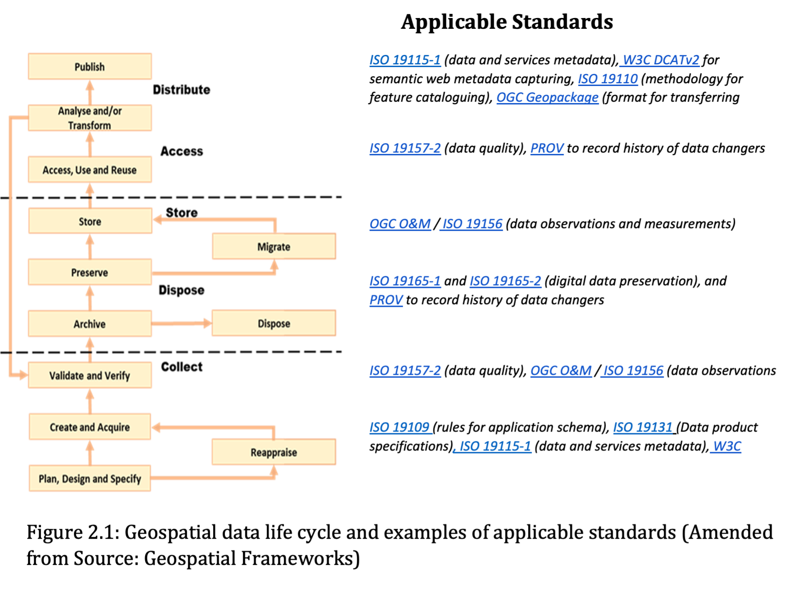
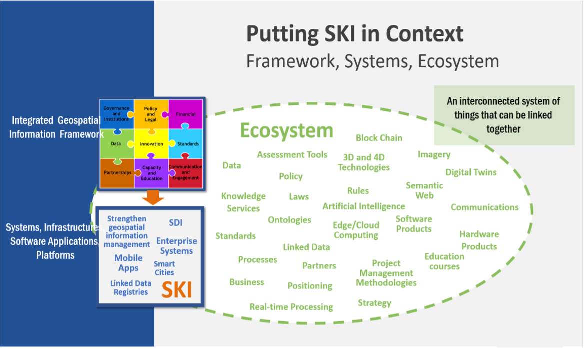
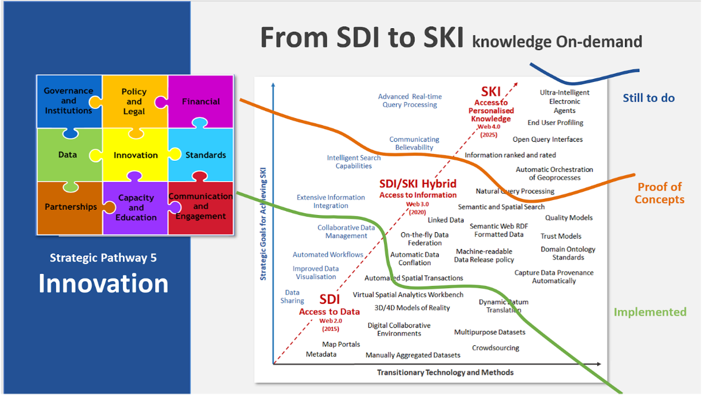

[[understanding_needs]]
:numbered:
== Understanding [Organizational Standards] Needs
:!numbered:

[width=818]
|===
| The purpose of this section is enabling the reader to: +
* Understand which standards are available to assess and address an organization's needs based on geospatial maturity level or tier. +
* Understand how standards are evolving along with changing needs and technologies.
|===

=== User Needs Perspectives

Understanding the standards landscape to support organizational standards needs is complex and commonly requires expert knowledge and advice. To understand organizational standards needs, it is helpful to look at user requirements from three different perspectives: the user, the data and from the organizational perspective.

==== The User Perspective

A user must have the ability to easily discover new knowledge, information, or data to address their needs. For example, a researcher may have knowledge gaps and would be required to define the data or information needed to address the knowledge gap. The researcher may check for existing data, define the data/information gap, discover or collect the missing data. A navigator on the bridge of a ship needs to know the depth of the sea as part of planning and conduct of their voyage. He or she is aware of and can discover the depth (bathymetric) information regularly collected and made available digitally via standardized Electronic Navigational Charts published by Hydrographic Offices. A non-expert could also be interested in the planning of offshore wind farms and needs to find the relevant data - How can a non-expert know where to find and discover this data? Similarly, a web developer building a website or application may be unfamiliar with the domain-specific content data and would need to find relevant standards and information.

==== The Data Perspective

Data providers and users should be aware that there are many considerations around data needs, e.g.:

* Ability to access and use data from:
** Legal and security perspectives (e.g. licensing, rights, restrictions, and responsibilities).
** Data format perspective (e.g., requirements for specific software)
** Data volume perspective (e.g., Big Data (imagery, geophysics) vs small data (e.g., laboratory analysis, manual field observations)).
* Maintaining and releasing data might satisfy specific or multiple needs depending on data types and collection methods, including:
** Earth and space imaging
** Historic and real-time observations from sensors / Internet of Things (IoT) devices
** Geospatial data themes (e.g., road networks, offshore bathymetry, building footprints)
** Map and Chart Products
** 3D models and simulations

To address these needs organizations should consider adopting metadata, data, and technical standards relevant to their specific domain(s).

==== The Organizational or Institutional Perspective

Needs can be expressed at different scales: from single to multiple organizations and information communities, for example local to national to global. At the organizational level, there is often a process in place to capture needs and gaps. Gaps and new needs can become part of an organization's future information policy and annual information plan to be integrated into existing practice. At the regional and global level, regional commissions and international bodies can be established to get a clear overview of national responsibilities / priorities in both data collection and understanding the gaps in data observation and measurements.

This section provides guidance on how to understand the organizational and broader SDI standards needs and gaps, and how standards can address these potential needs and gaps. There are five recommended steps and associated tools that guide users to identify gaps in standards implementation or adoption, as well as determine their needs and priorities. These steps are applicable for all SDI regardless of which level of maturity or tier it is in. More details on suggested standards can be found in the Taking Action Section.

[#table2_1]
[caption="Table 2.{counter:table2-num} "]
.Five recommended steps and associated tools for understanding and addressing standards needs.
[width=809]
|===
h| *Step* h| *Tool*
| 1. Determine the standards baseline and needs a|
* Framework for managing geospatial data lifecycle (<<figure2_1,Figure 2.1>>)
* Standards Baseline Survey (IGIF SP6, Appendix 6.2)
* https://drive.google.com/file/d/1nHctj0dJ1FNGbAsYbmva_EMfccYgQgX_/view?usp=sharing[Example of a metadata survey (Appendix 2), window="_blank"] to determine adoption of a metadata standard and issues with and priorities of its implementation
| 2. Choose the tier that matches the needs a|
* The Tier Maturity Matrix (<<figure1_5,Figures 1.5>> and <<figure1_6,1.6>>)
* Needs Assessment and Gap Analysis Template (IGIF SP6, Appendix 6.3)
| 3. Match standards to needs. a|
* https://drive.google.com/file/d/1DAb4QinqlEecqFzvtqi7JpnX7zzpdZJM/view?usp=sharing[Standards Inventory (Appendix 1), window="_blank"] provides recommended geospatial standards for each Tier.
* https://drive.google.com/file/d/1igF3xS4wfz7edKthEjmqtwIwJ_UqKBs0/view?usp=sharing[Vocabulary registry (Appendix 3), window="_blank"] provides a list of registers publishing generic and domain specific code lists and ontologies
| 4. Develop a roadmap to address the identified needs a|
* Needs Assessment and Gap Analysis Template (IGIF SP6, Appendix 6.3)
* https://drive.google.com/file/d/1KPTx28APjuqBKz8enh13RQFBc3NB7ZKJ/view?usp=sharing[Template for a Roadmap (Appendix 4), window="_blank"]
| 5. Identify the additional standards required (i.e., gaps and next actions) a|
* Needs Assessment and Gap Analysis Template (IGIF SP6, Appendix 6.3)
|===

There is no intention to suggest that every standard listed in this chapter and in the https://drive.google.com/file/d/1DAb4QinqlEecqFzvtqi7JpnX7zzpdZJM/view?usp=sharing[Standards Inventory (Appendix 1), window="_blank"] must be used at each Tier. Instead, these are meant as recommendations. The standards recommended in this Guide include the three general types of geospatial standards: (1) domain-specific standards, (2) general-purpose standards for geospatial information and technology specifically, and (3) general-purpose standards for information technologies and the internet generally, and also the three types of geospatial standards: (1) information (or content) standards, (2) service or interface standards and (3) procedural standards.

* *General-purpose: IT, Internet, and Information standards* on which geospatial standards may be dependent. While not all of these standards may be required for implementation, they may be required within an implementing community's operational environment. No information technology standards exist in isolation. There is a rich standards stack that supports all internet, web, and/or mobile applications. Recommended general IT and internet standards ( https://drive.google.com/file/d/1DAb4QinqlEecqFzvtqi7JpnX7zzpdZJM/view?usp=sharing[Appendix 1, window="_blank"]) are meant as a reference and are by no means all-inclusive. For example, there are many possible IETF, W3C, and OASIS standards for authentication, authorization, and security that could be used when implementing an SDI. The choice of which security standards to use should be determined as part of the system requirements analysis.
* *General-purpose: Geospatial information and technology standards* include good practice standards regarding geospatial data definitions, representation, data quality, general architecture and other aspects of geospatial information and technology. They collectively provide guidance on geospatial data collection, production, and maintenance. Geographic Information standards provide important background and guidance on key concepts of geospatial information definition, organization, and architectural representation. For example, http://www.iso.org/standard/39242.html[_ISO 6709_] and http://www.iso.org/standard/53539.html[_6709/Cor1_, window="_blank"] describe standardized representation of geographic point location by coordinates, http://www.iso.org/standard/74039.html[_ISO 19111_, window="_blank"] defines the requirements for defining coordinate reference systems, and _ISO19161-1_ describes the secondary realizations of the International Terrestrial Reference System (ITRS). http://www.ogc.org/standards/geopackage[_OGC GeoPackage_, window="_blank"] provides an open, standards-based, platform-independent, portable self-describing, compact format for transferring geospatial information, and the http://iho.int/en/standards-and-specifications[_IHO S-4_, window="_blank"] provides regulations for International Charts and Chart Specifications of the IHO.

=== Managing the Geospatial Data Lifecycle

Defining a framework and standards for effective management of geospatial data lifecycle is the first and probably most important step for any organization (<<table2_1,Table 2.1>>) since data supports all levels of capability and collaboration described in the 'Tiers: A Goal-based Approach to Implementation' subsection (<<figure1_5,Figure 1.5>>). Organizational success depends on how effectively and efficiently data can be applied in delivering products and services. Potential needs in managing data life cycle could include:

* Implementing consistent practices for geospatial data acquisition, management, and archiving.
* Discovering geospatial data within organizations.
* Defining processes for geospatial data archiving.
* Supporting digital geospatial data preservation.

Developed in 2016, the ' http://www.go-fair.org/fair-principles[FAIR Guiding Principles for data management and stewardship, window="_blank"] ' can be used to help with development of these capabilities. These guidelines intend to improve the Findability, Accessibility, Interoperability, and Reuse of digital assets, and emphasize machine-actionability (the capacity of computational systems to find and interrogate data with none or minimal human intervention) to support humans in dealing with increased volume, complexity, and creation speed of data. The FAIR Principles provide a very comprehensive framework for applying standards and dealing with all aspects of the data lifecycle, including the ability to collect, organize, describe, and manage geospatial information.

Standardized application schemas and feature catalogs support these capabilities. Quite often, an organization has existing digital geographic information they wish to visualize and share over the web. In this case, the organization would use the referenced standards for maturing their geospatial content collection, management, and update capabilities. These standards should be viewed in the context of the maturity of the SDI and transitioning to Spatial Knowledge Infrastructure (SKI) (Fig 2.2) activities in the organization. For example, a set of standards for transitioning from building portals for data accessed by humans to enable data being machine accessible and actionable via IoT.

Along with data management, organizations need to determine a policy on sharing data, specifically which themes or categories of geospatial information are to be shared. The IGIF SP2 Appendix 2.6 provides an example of aGap Analysis Matrix. Depending on the maturity of the system, sharing could be "view only" (solves the majority of use cases) or actual publication and transmission of physical data. At this level, one or more organizations agree to collaborate and share specific data holdings. Standards at this step in the process are sharing and access agreements, authentication/authorization rules, policies that can be documented and communicated, and/or cartographic symbolization rules.

Organizations should consider using the standards summarized in <<figure2_1,Figure 2.1>> to enable effective management of data and ability to easily apply it for any (re-)use. For details on these standards and the standards associated with the discussion of Tiers below, please see https://drive.google.com/file/d/1DAb4QinqlEecqFzvtqi7JpnX7zzpdZJM/view?usp=sharing[Appendix 1, window="_blank"].

[#figure2_1]
.Geospatial data life cycle and examples of applicable standards (Amended from Source: Geospatial Frameworks)

=== Functions and Needs by Tier

With reference to the tier diagram introduced in Direction Setting (<<figure1_5,Figures 1.5>> and <<figure1_6,1.6>>) and steps 2-3 of the 5 recommended steps (<<table2_1,Table 2.1>>), the following subsections underscore the geospatial functional and standards needs which organizations could address depending on its tier and system maturity.

==== Tier 1 - Share Maps Internally and Over the Web

Within a portal context, the most basic requirement is to be able to easily and effectively access and display geospatial information that may be stored in one or more databases and may use different vendor solutions and storage formats. Hence, the functions of visualization and portrayal, and subsequently catalogue and discovery are important at this tier. As identified in IGIF SP6 Appendix 6.3, potential needs at this tier could include:

* Visual overlay geospatial information as maps from different sources.
* Visualization of digital geospatial information as maps over the Web.
* Clear description of geospatial information (metadata).
* Discovery of geospatial information via online catalogs.
* Interoperability of internal and disconnected operations.

Therefore, the standards most widely implemented for Tier 1 are: http://www.ogc.org/standards/wms[_OGC Web Map Service (WMS)_, window="_blank"], http://www.ogc.org/standards/wmts[_OGC Web Map Tile Service (WMTS)_, window="_blank"], http://www.ogc.org/standards/kml[_OGC Keyhole Markup Language (KML)_, window="_blank"], and OGC Geography Markup Language (GML) (also http://www.iso.org/standard/75676.html[ISO 19136, window="_blank"]).

Associated with visualizing geospatial information may be the requirement to portray the information using an organization's symbology or cartographic presentation rules. There are available OGC standards to enable the ability to code, communicate and share visualization rules , such as http://www.ogc.org/standards/sld[_OGC Styled Layer Descriptor (SLD)_, window="_blank"], http://www.ogc.org/standards/se[_OGC Symbology Encoding_, window="_blank"], and http://www.ogc.org/standards/owc[_OGC Web Services Context (OWC)_, window="_blank"]. It is important to be aware that OGC web services while still broadly used worldwide are currently undertaking significant reform. The new OGC roadmap
footnote:[www.ogc.org/roadmap] focuses on the development of a family of http://ogcapi.ogc.org/[_OGC APIs_, window="_blank"] which will 'make it easy for anyone to provide geospatial data to the web'. These standards, built upon the legacy of the _OGC Web Service standards (WMS, WFS_, etc.), define APIs to take advantage of modern web development practices.

Most organizations further enhance their capability to support geospatial information and service discovery as well as metadata creation and browsing functionality. Properly populated, standards-based metadata allows end-users. to determine if a specific set of information is "fit for purpose" for a particular use case. The key standard for metadata of geospatial resources which has been widely applied and adopted at regional and national levels is the ISO 19115-X series.

The ISO and OGC standards for catalogue and discovery are widely implemented in national, regional, and local SDIs. Most geospatial technology vendors, as well as open source solutions, support these standards. These standards should be implemented if the community requires the need to search metadata holdings for the geospatial information they require. The metadata catalogue or registry can be made available to services, including clients, using one of the _OGC Catalogue Service-Web (CSW)_ profiles and/or the https://www.w3.org/TR/vocab-dcat-2/[_W3C DCAT_, window="_blank"] data catalog vocabularies.

==== Tier 2 - Geospatial Information Partnerships

Once the desired geospatial information can be discovered and viewed as a seamless set of maps, then the infrastructure is mature enough to consider publishing content and transmitting data (content) to end users. In this Tier, the community and infrastructure have matured to the point that the services are stable and the community and partnerships are growing, requesting more functionality and capability. Potential organizational or SDI needs identified in IGIF SP6 Appendix 6.3 include:

* Ability to share detailed geospatial information within and with other organizations.
* Enhanced ability to apply geospatial data for improved situational awareness, analysis, and decision support.
* Ability to maintain and improve quality of common geospatial information between cooperating organizations.
* Organization agreements to share data using agreed upon standards-based data models.

For example, as more partners (public and private) wish to be part of a CoP to support collaborative sharing and maintenance of geospatial information content, the infrastructure of participating organizations will need to accommodate the use of additional international technology standards and community information model standards. At this stage, organizations would have to consider two of the three key types of geospatial standards:

* Information (or content) standards, and
* Technology (interface, API) standards.

An information model in software engineering is a representation of concepts and the relationships, constraints, rules, and operations to specify data semantics for a chosen domain of discourse, such as transportation, hydrology, or aviation. The goal of such models is to allow multiple stakeholders across many jurisdictions to have an agreement on how to express data for a specific domain, such as weather, geology, or land use. Such agreements significantly enhance interoperability and the ability to share geospatial information at any time and as required. For some time https://www.ogc.org/standards/gml[_OGC Geography Markup Language_, window="_blank"] / https://committee.iso.org/sites/tc211/home/projects/projects---complete-list/iso-19136-2.html[_ISO 19136_, window="_blank"] _(GML)_ Application Schemas and encoding has been the primary OGC/ISO standards-based approach used for modelling, encoding, and transporting geospatial information.

For geospatial information query and access, there are standards which allow the application and user to specify geographic and attribute queries and request that the geospatial information be returned as an encoding. Recommended standards to support this capability can be found in the Standards Inventory ( https://drive.google.com/file/d/1DAb4QinqlEecqFzvtqi7JpnX7zzpdZJM/view?usp=sharing[Appendix 1, window="_blank"]) and elaborated in the Taking Actions section later in this Guide.

Common distribution formats are http://www.ogc.org/standards/gml[_GML_, window="_blank"], https://www.iso.org/standard/20305.html[_ISO 8211_, window="_blank"] (used by http://iho.int/en/standards-and-specifications[_IHO S-57 and IHO S-100_, window="_blank"]), http://www.ogc.org/standards/geotiff[OGC _GeoTiff_, window="_blank"]. International open standards are better than proprietary or locally defined formats as they reduce costs and enhance collaboration with outside groups. There are also standard ways for requesting geospatial information, packaging that information, and transmitting the information. For example, if the user wants the transportation theme as a GML dataset or a chart in IHO _S-101_ or _S-57_, then the server-based software needs to be able to generate the information in the requested formats. These requests for publication are performed using simple web calls. Distribution can be in any number of standard formats, such as _GeoTIFF_ or _GML_ files. The required data can be streamed from the server to the client application or for very large files can be uploaded to an ftp site or accessed through flexible web file sharing services (e.g., API) at any time.

===== Domain-Specific Data Models

At Tier 2, organizations should consider abstract standards or models that describe such geographic information elements as geometry (points, lines, polygons), coordinate reference systems, data quality, time, and so forth. Similarly, domain data modelling extends information modelling by enabling the reuse of concepts, semantics, and information organization (schemas) between related systems. While information modelling typically refers to modelling just one system, domain modelling involves the practice of creating definitions of concepts which are reused between multiple systems. In the standards context this is further extended to imply interoperability of models and platform independence.

Both information models and domain models are relevant to Tier 2 and Tier 3 in the evolution of an SDI. Using such domain-specific, information or content standards helps to guarantee that geospatial information can be encoded and shared with consistent semantics, geometry, quality, and provenance. Further, data models tend to be encoding tools agnostic, meaning the content can be encoded using XML, JSON, and other encoding technologies. Examples of these models include https://www.ogc.org/standards/citygml[_OGC CityGML 2.0_, window="_blank"], https://www.iso.org/standard/51206.html[_ISO 19152 LADM_, window="_blank"], http://www.ogc.org/standards/infragml[_OGC LandInfra/InfraGML_, window="_blank"], https://iho.int/en/standards-and-specifications[_IHO S-100_, window="_blank"] https://iho.int/en/standards-and-specifications[General Feature Model and Geospatial Registry, window="_blank"] _and_ https://iho.int/en/standards-and-specifications[IHO S-57, window="_blank"] Transfer Standards for Digital Hydrographic Data._

To summarize, domain-specific standards and content data models refer to community agreements on the elements, relationships between elements, semantics and so forth for a specific data set in a given domain. The models are implementation independent and vendor neutral. In order to automate and make the exchange of domain specific geospatial data seamless, consensus needs to be built among the community participants on:

* A shared data model for data exchange, in terms of a common understanding and agreement for how different systems "understand" each other.
* Common definitions of the different data entities and their properties.

* Common controlled vocabularies and taxonomies.

In the case of a transportation network, common agreements and vocabularies mean that:

* All stakeholders agree on how to display (symbolize) the transportation network.
* All stakeholders agree to what each attribute, such as road width, means in terms of the shared view of the transportation network.
* All stakeholders agree to a common view of the road classification system.

This use of common data models is part of the natural evolution and progression of an SDI that leads to the concept of foundation or framework SDI data themes. This evolution is described in greater detail in the Tier 3 discussion. Good references on the domain modelling and content models are http://www.iso.org/standard/59193.html[_ISO 19109, Geographic information – Rules for application schemas_, window="_blank"] and the https://portal.ogc.org/files/11-107[] https://portal.ogc.org/files/11-107[_OGC OWS-8 Domain Modelling Cookbook_, window="_blank"]. These documents describe rules and good practices for building and maintaining inter-related domain models, which have dependencies on multiple systems. They describe how to build interoperable, maintainable domain models, the challenges and pitfalls faced in building these models, the techniques and patterns that should be applied, and specific tools that can be used.

These agreements enable specific organizations to avoid changing their software or processes by agreeing on a shared data model and semantics (vocabulary, terms and definitions, etc.) used in the model. There are currently many such models available that have been developed and agreed to by international organizations or communities. These models should be considered first prior to considering the development of new data models.

==== Tier 3 - Spatially Enabling the Nation

In this Tier, the infrastructure is mature enough to: (1) provide access to multiple themes of information via a variety of environments (e.g., mobile, desktop); (2) support deployment of more applications to enhance value, provide increased citizen benefit, increase collaboration between organizations; and (3) integration of an increasing number of geospatial information resources, including volunteer, crowdsourced and real time sensor feeds. Completion of the needs assessment and gap analysis template described in IGIF SP6 Appendix 6.3 would have identified potential needs including:

* Delivery of "foundation" or "framework" geospatial information.
* Provision of geoprocessing services to perform spatial analysis and modeling.
* Development of mobile applications.
* Integration of real-time sensor feeds.
* Customized products and applications.

Standards are available to facilitate implementation of geoprocessing and analytics services, grid systems, mobile applications: capturing and integrating real-time sensor data, and geosemantics. These trends are further elaborated in the 'Taking Action' chapter and relevant standards or frameworks can be found in https://drive.google.com/file/d/1DAb4QinqlEecqFzvtqi7JpnX7zzpdZJM/view?usp=sharing[Appendix 1, window="_blank"].

[type=a]
. *Geoprocessing & Analytics*– http://www.ogc.org/standards/wps[_OGC Web Processing Service (WPS)_, window="_blank"]and http://www.ogc.org/standards/wcps[_OGC Web Coverage Processing Service (WCPS)_, window="_blank"]
. *Grid Systems* – http://docs.opengeospatial.org/as/15-104r5/15-104r5.html[_OGC Discrete Global Grid Systems_, window="_blank"]and _http://www.iso.org/standard/32588.html[ISO] http://www.iso.org/standard/32588.html[19170-1]_
. *Mobile Applications* – http://www.ogc.org/standards/geosms[_OGC Open GeoSMS_, window="_blank"] and http://www.ogc.org/standards/geopackage[_OGC GeoPackage_, window="_blank"]
. *Real-Time Sensors* – http://www.ogc.org/node/698[_OGC Sensor Web Enablement (SWE)_, window="_blank"] http://www.ogc.org/node/698[standards, window="_blank"] and http://www.ogc.org/standards/sensorthings[_OGC SensorThings API_, window="_blank"]
. *GeoSemantics -* The http://www.w3.org/groups/ig/sdw[Spatial Data on the Web Interest Group, window="_blank"] (W3C/OGC) is one of the communities that provides significant input to development of good practices and vocabularies that encourage better sharing of spatial data on the Web; and identify areas where standards should be developed jointly by both W3C, OGC and ISO, including http://www.ogc.org/standards/geosparql[_OGC GeoSPARQL_, window="_blank"], http://www.ogc.org/standards/api-features[_OGC API Features_, window="_blank"]/ https://www.iso.org/standard/32586.html[_ISO 19168-1_, window="_blank"] and _ISO_ http://www.iso.org/standard/57465.html[_19150-1_, window="_blank"]/ https://www.iso.org/standard/57466.html[_19150-2_, window="_blank"]/ https://www.iso.org/standard/72177.html[_19150-4_, window="_blank"].

An excellent example of operational use of OGC SWE standards is the https://docs.opengeospatial.org/guides/19-050.html[Debris Flow Monitoring System, window="_blank"] deployed in Chinese Taipei. This program uses OGC Web Services and OGC SensorThings standards integrated into a monitoring, modelling, and alerting infrastructure. (See also: https://youtu.be/6Hb2iXQQ8TY[https://youtu.be/6Hb2iXQQ8TY, window="_blank"]).

==== *Tier 4 - Towards Spatially Enabled IT Infrastructure

Tier 4 involves the transition of current SDI into a broader Spatial Knowledge Infrastructure (SKI) that can be strategically planned based on: (1) emerging standards and technology trends that are addressing known gaps, challenges and needs (refer to Direction Setting chapter - Emerging Standards and Trends); (2) delivering geospatial information into the Web of data and bridging the SDI to a broader ecosystem of

information systems (<<figure2_2,Figure 2.2>>), and (3) The SDI to SKI -Maturity Matrix (<<figure2_3,Figure 2.3>>). A

[#figure2_2]
.Putting SKI in Context

'needs assessment and gap analysis template' described in IGIF SP6 Appendix 6.3 has identified two potential needs of an SDI at the Tier 4 level:

* Establishment and implementation of standards for the global geospatial information community
* Understanding and preparation for emerging standards, good practices, and trends.

[#figure2_3]
.From SDI to SKI – Maturity Matrix

Standards are constantly being produced and updated based on prevailing technologies and user needs and challenges. The SDOs - ISO/TC211, OGC, IHO and W3C have online standards registries where the latest standards and information are made available and accessible ( https://drive.google.com/file/d/17y36KQj7bX_anDeDf-hGkbJbEVlPeySY/view?usp=sharing[Appendix 5, window="_blank"]). Trends are driving requirements for enhancing existing geospatial standards, rethinking and crafting a new generation of standards based on the lessons learned of the existing baseline. It is also opportune that the implementation of a new suite of standards leverages the value of the emerging ecosystem of technologies and user requirements.

The bridging of the SDI and broader ecosystem of knowledge information systems can be done at the web services/API or database level. There are existing suites of standards that could kickstart enhancement of SDIs for future SKI capabilities. For instance: *OGC APIs* as well as new and upcoming Tier 4 standards are included for review in https://docs.google.com/spreadsheets/d/1wKoIqQWX_T4F9mXGS4gRRF5bwxyOk6PC4TCg5BzEWPk/edit?usp=sharing[Appendix 6, window="_blank"].
