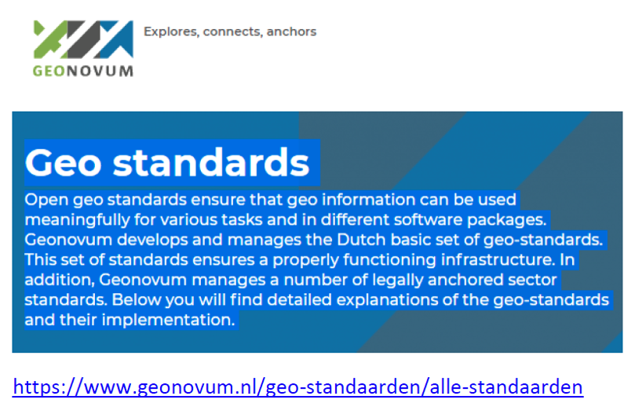

:numbered:
== Planning for Change
:!numbered:

|===
| The purpose of this section is enabling the reader to understand: +
* How other nations or organizations have implemented and used standards to meet their needs. +
* The types of business needs that may be supported through the implementation of standards, advocating for the adoption of standards to facilitate interoperability and other efficiencies. +
* The importance of considering and implementing standards as part of the systems development lifecycle, and the importance of contributing to and providing feedback to the development of standards through direct participation and provision of feedback. +
* How to play a role in the identification of opportunities for standardization in the context of their domain, and act as advocates to engage related communities of practice to facilitate alignment and interoperability at various levels.
|===

Properly functioning geographic information management operations include well governed selection and adoption of open standards, and prioritized engagement in developing international (and where necessary) national standards, along with guidelines, skills development, supporting software, and a functioning CoP.

To achieve this, the following components are required:

* Governance across the national framework, including central government, devolved (regional) administrations, local government, and technical implementing organizations.
* An endorsed national policy and legal framework.
* Leadership for each part of the national framework, including the standards pathway.
* An active communications plan.
* Bridges to the international and national standards bodies.
* Mechanisms to influence adoption, such as spend controls and local government information standards.
* Partnerships with industry to develop tools.
* Partnerships with universities and professional bodies to deliver skills training.
* An underpinning and sustainable financial plan, including clear management of benefit realization.

=== Institutional Arrangements

==== Governing Bodies

It is important for implementing organizations to recognize the many interested parties that have different roles in governance. Examples of governance bodies relevant to standards for geospatial information management include:

* The national lead organization for geospatial initiatives (e.g., development and/or setting national standards, implementation of national SDIs and/or coordination between SDIs at the national level, etc.).
* The national lead department for digital government, data, or information technology.
* The government office responsible for implementing digitalization of government services.
* Any government or semi-government body already responsible for data or IT standards.
* Specific departments based on the role of geospatial data and information in their business.

[#figure3_1]
.Geonovum statement on Dutch Geospatial Standards

Other bodies may also have a strong role to play:

* The national standards body,
* Bodies responsible for higher level technical training,
* Relevant professional bodies.

One of the first steps in the planning process is to confirm the organizational governance roles, structures, and processes to organize and guide the implementation of the action plan. It is important to ensure that the foundation is in place to be able to set up project oversight and implementation structures (implementation and persistent governance structures and teams), assess and determine scope and resource requirements to deliver on the action plan (including post-implementation), and implement changes outlined in the action plan.

Examples of key activities include:

* Ensure that all roles, responsibilities, and organizational structures are in place according to national policy and plan to foster a successful implementation.
* Identify the level of organizational capability required to meet the mission (see Section 2 on Understanding Needs).
* Define the level of organizational engagement and resources necessary for participation in the national governance process, as described in IGIF SP6 section 6.6.1, for successful cooperation between national agencies and stakeholders for sharing and exchanging geospatial data.
* Ensure that acquisition/procurement actions include requirements for common nationally endorsed standards.

===== Roles and Responsibilities for National Standards Governance

The governance of standards is a collaborative system involving stakeholders from governmental organizations, industry and academia, technologists and domain experts, SDOs, and the general public. Activities range from defining the requirements for standards, standards development and feedback, adoption, and implementation, and verifying compliance, and development and implementation of guiding policies and implementation artifacts (e.g., legislature, etc.). Annex 6.4 of the IGIF provides examples of typical roles and activities, and their relevance to governance for standards.

==== Bridges – Linkages to Standards Bodies

These ensure that international policy and standards are well understood within the country, and that the international standards bodies understand any specific issues relevant to your country.

Where bridges lead will depend on the set of standards deemed to be important. Engagement with organizations such as OGC and W3C may be direct, while engagement with ISO, IHO, or IETF may require a 'bridge' such as a national mirror committee that may be managed by a national standards body. Such committee may require a national government representative, for instance from the national standards body, to participate on behalf of all organizations in a nation.

==== Mechanisms to Influence Adoption

Adoption of standards by individual organizations can be influenced through many strategies, such as:

* *Directives* - adoption based on legal or other mandated requirements.
* *Negotiation* - between partners, within a CoP, etc.
* *Certification, compliance* - these may come in the form of requirements or provide value such as competitive advantage to the organization.
* *Engagement*- demonstrate value of adoption, education and raising awareness.
* *Spend controls* - invest or withhold funding based on support needed to adopt or consequence of not being compliant.

Although it would be desirable for organizations to simply believe in and adopt standards because it is the right thing to do, this approach is generally not practical. There tends to be sufficient flexibility in relevant standards to enable fine tuning the implementation to meet the organization's needs (e.g., profiles of the _ISO 19115-1 Metadata_ standard are one such example). Furthermore, when the intent is to achieve interoperability through adoption of standards by cooperating organizations in a community, goodwill alone tends to be insufficient. Therefore, a mix of clear direction, coupled with strong community engagement must be incorporated into any national action plan.

* Adoption by the central government can be influenced through direction and spend controls, which may depend on a national technology code of practice. Governance for geographic data should fit in with this national control.
* Adoption by devolved administrations can be influenced through negotiation, certification requirements, engagement, and other means.
* Adoption by local authorities can be influenced through negotiation and engagement via a national coordinating body, the local government information standards organization, etc. This may include councils, police, fire, health etc.
* Adoption by the private sector can mainly be influenced via national geospatial standards policy (endorsed standards), and via acquisition language (e.g., mandatory application of specific standards). Professional education also has a part to play, both at an initial level through university courses, and an ongoing level through professional bodies for geographic information, surveying, cartography, geography, IT, project management.

=== Action Plan

The work leading up to an adopted plan of action typically involves generic project planning activities consistent with those employed on any change initiative. An important first step of any action plan is to define its outcomes - what the Action Plan should ultimately achieve. The IGIF SP6 describes two perspectives which contribute to the overall outcomes of the plan, Business Capabilities and Technical Capabilities. The capabilities needed or desired by an organization may be impacted by many factors. The business and technical capabilities outlined in this document are organized according to their typical implementation, supporting a stepwise evolution starting with small scale (single organization/community) and incrementally adding capabilities required to work across larger communities (multiple organizations).

Large-scale change initiatives may have impacts on the organization in many ways. In terms of standards, key questions to be considered in the planning process include:

* *What*: What are the expected outcomes of the action plan? It is critical to consider the desired outcomes of the action plan from various perspectives. The IGIF SP6 and Understanding [Organizational Standards] Needs section in this document provide examples of outcomes from the technical (e.g., infrastructure capabilities, interoperability, etc.) and business (e.g., single to multi-organizational or jurisdictional coordination, etc.) perspectives, though there may be others to consider.
* *When*: When do we intend to reach our goals or different steps? It is important to establish an implementation strategy and schedule that reflects the chosen approach. The Direction Setting and Understanding [Organizational Standards] Needs sections of this document outline potential objectives for the action plan and in some cases, such as the geospatial tiers, these are presented in a manner that lend themselves to a stepwise implementation. It is important to consider factors including the impact and complexity of the desired change(s), the realities faced by the entities impacted by the desired change(s), any factors which impact how the change must be implemented, and the relative priorities of desired changes and where those changes are implemented. Stepwise approaches may take longer to fully implement but can involve significantly less risk than 'big bang' implementations. Planning organization level change such that successes are achieved and promoted early is key to maintaining momentum through delivery of results. When all factors are considered, an implementation schedule with milestones should be developed, communicating the schedule, priorities, and key checkpoints used to monitor progress.
* *Who:*Who are the key experts and decision-makers needed to support the activities identified? When considering the delivery of any change initiative, it is critical to understand those leading, implementing, and impacted by the change. Examples of such stakeholders include:
** Governance and policy bodies as defined in the IGIF SP6.
** Experts needed for developing information models, specifications, and IT environments.
** Organizations providing experts.
** Organizations responsible as authoritative data owners.
** Reference groups and stakeholders.

In addition to identifying the key stakeholder groups and their respective roles(s), it is also important to consider whether individual stakeholder groups are supportive or oppose the strategic direction proposed in the action plan. Supportive stakeholders can act as champions for change, while opposition must be managed as risk. Ensuring support and progress requires active engagement, with greater investment made to manage areas of risk.

* *Costs and funding:* What are the costs? What types of costs? How is the national plan funded? Even after the project scope, schedule, and stakeholders are identified, it is important to consider the one-time and ongoing costs to implementing the national plan and how the work will be sustained into the future. Costs may be direct (procurement of IT infrastructure, procurement of or modification to IT systems, changing needs for human resource), indirect (changes to business processes, governance structures), and may be attributed to the action plan or considered in-kind exchanges.

The assessment of the types and anticipated costs not only supports the justification necessary to ensure the availability of resourcing to implement and sustain the results of the action plan, but also serves as a reference for discussing costs with stakeholders, particularly those that see cost as a major barrier to the action plan or their participation.

* *Relation to other initiatives or activities:* A major national project will have an impact on other ongoing projects, and there can be both synergies and challenges to deal with. Certainly, relationships to the implementation of other Strategic Pathways at a national level will be highly relevant. Engagement with other relevant initiatives or activities provides an opportunity to implement consistent messaging on topics of agreement and investigate differences prior to engaging stakeholders.

It is important to promote and seek alignment between independent efforts whenever possible, and where there are differences that cannot be fully resolved, frame them to support those involved. This typically requires additional supporting context and engagement for impacted stakeholders to understand the differences and the rationale. Unresolved differences must be handled with care as these may impact the implementation of the national plan (e.g., avoid leaving individual organizations to choose between the action plan and an independent initiative).

* *Capacity Building*: What is the approach for capacity building and what tools and resources are available? As the action plan is implemented, it is important to provide support to participants to ensure their successful engagement with the project. The Ongoing Management section of this document outlines key maintenance activities necessary to ensure that implementations of standards continue to perform optimally, specifically the standards review process and the role of communities of practice. The action plan should also include feedback and other mechanisms needed for the project to respond to any issues raised during its implementation.
