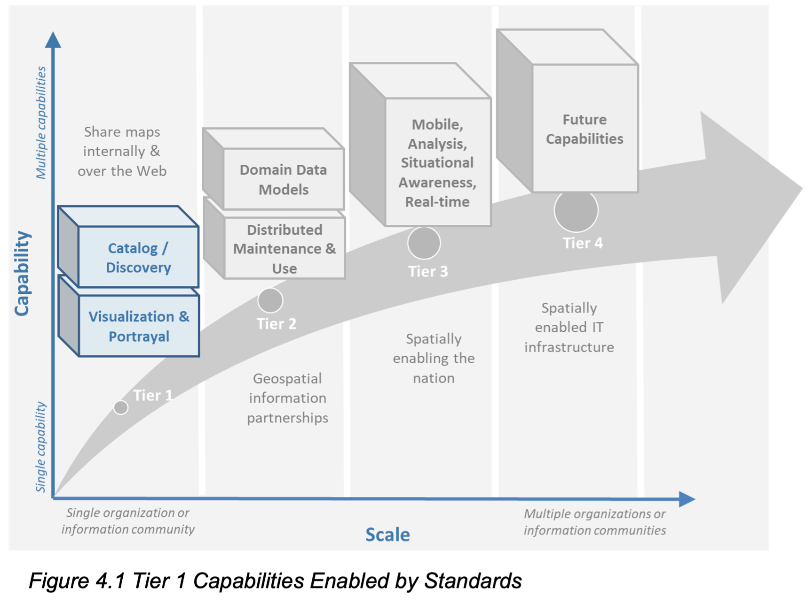
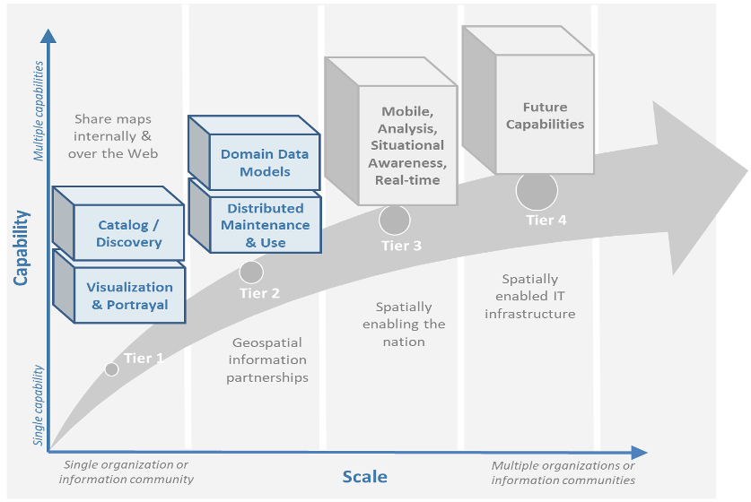
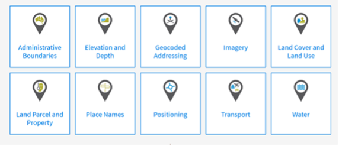
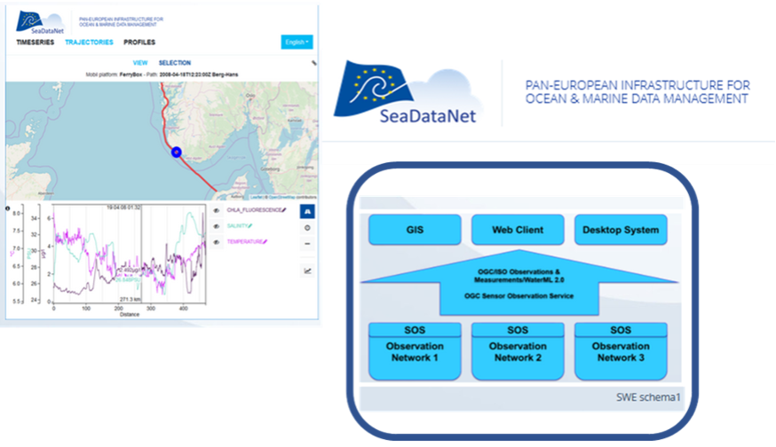
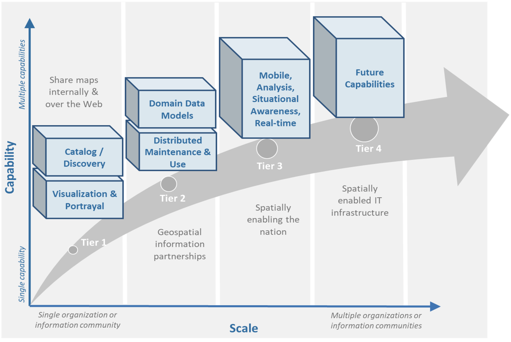
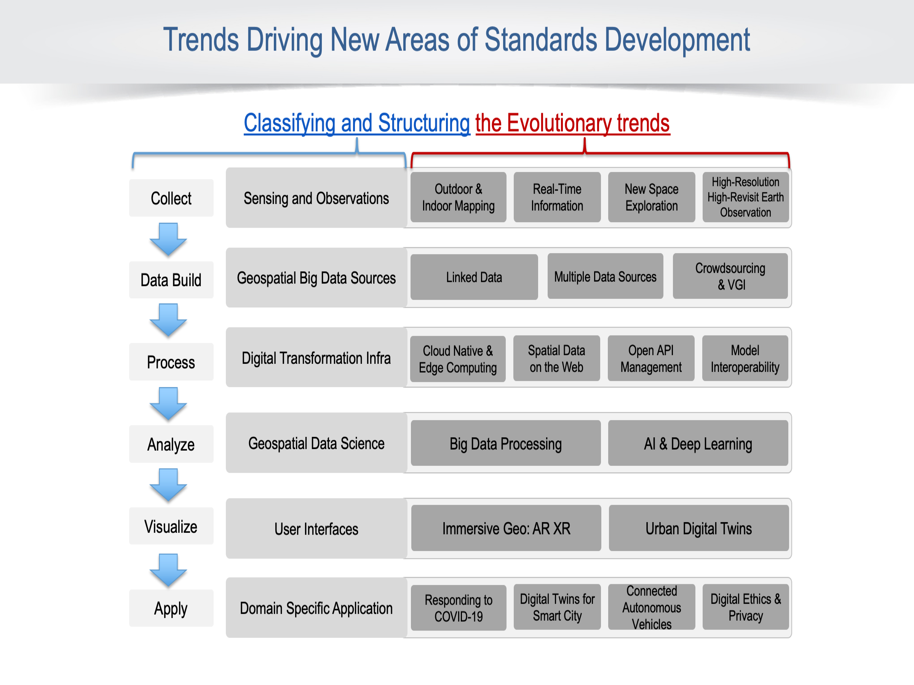

:numbered:
== Taking Action
:!numbered:

|===
| The purpose of this section is enabling the reader to: +
* Understand the level of maturity of the nation and/or organization and thereby the level of complexity and the potential work that needs to be done during the implementation phase. +
* Match the standards required to fulfill their needs to a given maturity level, +
* Understand details about what standards are needed and applicable in different cases, how to access the standards, and how to take the essential steps to implement those standards. +
* Understand the standards and provide feedback into the ongoing development of the implemented standards.
|===

=== Implementation

This section describes which standards may be appropriate to use in each of the Tiers as identified in <<figure1_5,Figure 1.5>>. The list of standards provided is not intended to mean that every standard is mandatory at each Tier. Instead, these are meant as recommendations. For example, a number of standards are listed for Tier 1 (see https://drive.google.com/file/d/1DAb4QinqlEecqFzvtqi7JpnX7zzpdZJM/view?usp=sharing[Appendix 1]). Of the list provided for Tier 1, an initial SDI implementation may only implement one or two of the suggested standards. Further, standards recommended in Tier 2 could be implemented in Tier 1 and vice versa. The final decision as to which standards are implemented must be based on specific requirements and use cases.

=== Foundational Standards

Important to mention are two categories of standards that can be called "foundational", which means they support all Tiers. They are:

* *General information technology and Internet standards* on which geospatial standards may be dependent. While not all of these standards may be required for implementation, they may be required within an implementing community's operational environment.
* *General Geospatial Standards* which include good practice standards regarding geospatial data definitions, representation, data quality, general architecture and other aspects of geospatial information and technology. They collectively provide guidance on geospatial data collection, production, and maintenance.

General IT and Internet standards are required to implement any web or internet-based solution. No information technology standards exist in isolation. There is a rich standards stack that supports all internet, web, and/or mobile applications. These standards are listed as "General IT" in https://drive.google.com/file/d/1DAb4QinqlEecqFzvtqi7JpnX7zzpdZJM/view?usp=sharing[Appendix 1].

General geographic information standards provide key concepts of geospatial information definition, organization, and architectural representation. These standards are listed as "General Geospatial" in https://drive.google.com/file/d/1DAb4QinqlEecqFzvtqi7JpnX7zzpdZJM/view?usp=sharing[Appendix 1].

Please note that not all of these standards are required for implementation, but they may be required or expected to be present in a community's operating environment. Furthermore, most OGC standards reference one or more of these foundational standards.

=== Tier 1 - Share Maps Internally and Over the Web

*Tier 1 Goal* – The most fundamental requirement in Tier 1 (see fig. 4.1) is to enable the stakeholders and constituents (users) of an organization or institution to view and query interactive maps on the web. A https://en.wikipedia.org/wiki/Map[map] is a depiction (i.e., an image) representing geospatial facts, provided for human consumption. Beyond this human-centric service and closely associated with this fundamental requirement is the general ability to discover, share and use geospatial information, including (but not limited to) machine-readable representation.

An organizational or institutional goal is to provide staff, partners, and customers with the ability to view and query geospatial information in existing client applications using a variety of devices such as a desktop, tablet, or other mobile devices. This can include information developed by an organization itself or web accessible data available from other organizations. By using a web browser or smartphone, users can look up different "layers" of information. They can display, zoom into points of interest, and print maps while keeping their organizational IT infrastructure intact. As more maps are published, catalogs become necessary to enable map providers to advertise the availability of their maps and users to find them.

To achieve this goal, there are some basic requirements that must be met. The same terminology and semantics must be used. The data must be modelled in a way that makes it possible to access and display data across platforms and formats.

The capabilities of Tier 1 are:

* Harmonized terminology and semantics
* Data modelled and described based on harmonized terminology and semantics
* Clear description of geospatial data (i.e., metadata)
* The ability to discover metadata via on-line catalogs
* The ability to visualize digital geospatial information as maps over the Web, from a single source or overlaid from several different sources.

[#figure4_1]
.Tier 1 Capabilities Enabled by Standards

Listed below are a few features and benefits that a Tier 1 solution can fulfill:

* Establishing a simple, low-cost way to share and view geospatial information as images with stakeholders and constituents.
* The ability to implement solutions that enable any desired combination of standards-based geospatial technologies - enabling interoperability.
* Storing and managing Geospatial information locally in a preferred format, with no need to incur the time and expense of reformatting geospatial information into a single required format.
* Allowing geospatial data to remain with the owner and maintainer of the data to increase the likelihood of update.
* The ability to publish maps for on-line government and citizen access.

At this initial level of capability, policy and governance related to geospatial information management and operations may be somewhat informal.

The following represent some implementation considerations regarding the capabilities depicted for Tier 1 in <<figure4_1,Figure 4.1>>.

==== Visualization and Portrayal

The most basic requirement in an SDI is to be able to easily and effectively access, integrate, and display geospatial information that may be stored in one or more databases using different geospatial technology solutions and storage formats. Of the Tier 1 standards listed in https://drive.google.com/file/d/1DAb4QinqlEecqFzvtqi7JpnX7zzpdZJM/view?usp=sharing[Appendix 1] table 4.1, by using just http://www.ogc.org/standards/wms[_OGC WMS_] an organization can generate web-based applications that provide access to spatial information holdings, regardless of the formats used or GIS technology deployed. Many organizations have implemented _OGC WMS_ first to provide seamless access to geospatial information. These deployments provide quick, short term success and return on investment. If the data that an organization wants to display on the internet are already organized in tiles, then there is also the possibility of using http://www.ogc.org/standards/wmts[_OGC WMTS_]. As implementations mature, most organizations can enhance their SDI capability with discovery and metadata browsing capability.

The Tier 1 standards recommended for implementing powerful access, browsing, visualization and display capability are listed in https://drive.google.com/file/d/1DAb4QinqlEecqFzvtqi7JpnX7zzpdZJM/view?usp=sharing[Appendix 1]. These standards provide the ability for the user to access and display geospatial information as images in any browser.

==== Catalogue and Discovery

The ISO and OGC standards for catalogue and discovery are widely implemented in national, regional, and local SDIs. Most geospatial technology vendors and open-source solutions support these standards. Implementation of these standards, listed in https://drive.google.com/file/d/1DAb4QinqlEecqFzvtqi7JpnX7zzpdZJM/view?usp=sharing[Appendix 1] and table 4.1 are required to provide the ability to search metadata holdings for specific geospatial information of interest. The metadata and catalogue searches also allow the user to determine if the geospatial information is fit for a particular use or purpose.

The content of a catalogue is metadata. Metadata is a description of a resource, in this case a geospatial resource. The catalogue provides the services to search and publish the metadata for data, services, and related types of data.

[caption="Table 4.{counter:table4-num} "]
.Standards in Tier 1, for standard descriptions see https://drive.google.com/file/d/1DAb4QinqlEecqFzvtqi7JpnX7zzpdZJM/view?usp=sharing[Appendix 1]
|===
h| *Technology in Tier1* h| *Relevant Standard*
.6+| Visualization and Portrayal | OGC Web Map Service
| OGC Web Map Tile Service
| OGC Styled Layer Descriptor
| OGC Symbology Encoding
| OGC Web Services Context Document
| IHO S-100 Part 9 – Universal Hydrographic Data Model Part 9 - Portrayal
.5+| Catalogue and Discovery | ISO 19115-1:2014, Geographic information — Metadata — Part 1: Fundamentals
| ISO 19115-2:2019, Geographic information — Metadata — Part 2: Extensions for acquisition and processing
| ISO 19115-3:2016, Geographic information - Metadata - Part 3: XML schema implementation for fundamental concepts
| OGC Catalogue Service
| Data Catalog (DCAT) Vocabulary Version 2
|===

=== Tier 2 - Geospatial Information Partnerships

Tier 2 Goal (see <<figure4_2,Figure 4.2>>) -- An information community wishes to provide access to geospatial information over the Web, provide geospatial information download services, and in addition, may wish to collaborate across jurisdictions on maintenance and update of specific data themes, such as roads, from multiple sources that conform to agreed upon standards-based data models to create a consistent and integrated definition or meaning of the geospatial information for users.

The main drivers for a move from Tier 1 to Tier 2 are:

1) The need to share geospatial data rather than maps in order to support more detailed analysis forecasting and other more powerful decision support applications, and

2) The desire to achieve interoperability within a community based on agreed upon standards-based data models for data exchange and maintenance.

[#figure4_2]
.Tier 2 Capability Enabled by Standards

Organizations may wish to publish their geospatial information on the web. Furthermore, one or more organizations may wish to work with other members of a community to build, share, maintain and use datasets that provide a common operational view of important issues such as safe navigation, flood control, road maintenance, disaster management or bush fire management and response. Using this approach, data providers do not need to adopt the same technology solutions or change their database structures provided that they conform to agreed upon standards and data models. Through the use of Tier 2 open standards, they can provide access to view, distribute, or share geospatial information that conforms to these agreed upon standards-based data models.

As a result of the approach described above, users accessing geospatial content delivered in this way will be able to view, process and analyze geospatial information seamlessly, even though the data may be provided from multiple sources. Other user communities requesting geospatial information will receive the content in a common structure (format), which will facilitate its use in additional end user applications.

In addition to Tier 1 capabilities, Tier 2 capabilities include:

* Access to geospatial information for viewing, analysis and other applications can be provided to all stakeholders and constituents using a consistent, well documented standards-based approach.
* Publishing of geospatial information is enhanced by adherence to agreed upon data content models for distribution and application. Content owners do not need to change their underlying models, nor do they need to change their current geospatial technology provider (unless that provider does not provide standards-based approaches).
* Overall costs are reduced since existing geospatial technology can be leveraged.
* Existing geospatial information can be repurposed, with reduced reliance on format translation, and with enhanced quality of data and services.
* Access to geospatial information and services can be controlled through access authorization.
* Collaborative data maintenance capability is enabled (see below).

The following key standards are recommended for possible use in Tier 2 (see Table 4.2 for more detailed list).

==== Distributed Maintenance and Use

The goal of information models is to allow multiple stakeholders across many jurisdictions to have an agreement on how to express data for a specific domain, such as weather, geology, or land use. Such agreements significantly enhance interoperability and the ability to share geospatial information at any time and as required. Followings are some examples of the standards that can be implemented for sharing geospatial information.

For information modelling and encoding: http://www.ogc.org/standards/gml[_GML_] is the primary OGC/ISO standard used for modelling, encoding, and transporting geospatial information. In addition, a number of OGC standards reference and use http://www.ogc.org/standards/om[_OGC Observations and Measurements_] _(O&M) (also ISO_ https://www.iso.org/standard/32574.html[_19156_] _)_ is discussed as part of the Tier 3 standards recommendations. While O&M is used by a number of Tier 2 recommended standards, knowledge of this standard is not required until Tier 3.

* http://www.ogc.org/standards/gml[_OGC_]_/_ https://www.iso.org/standard/75676.html[_ISO 19136_]_Geography Markup Language (GML)_ is XML grammar for expressing geographical features. GML serves as a modeling language for geographic systems as well as an open interchange format for geographic transactions on the Internet.

For geospatial information query and access: The following standards allow the application and user to specify geographic and attribute queries and request that the geospatial information be returned as an encoding.

* http://www.ogc.org/standards/wfs[_OGC_]_/_ https://www.iso.org/standard/42136.html[_ISO 19142_] _Web Feature Service 2.0_ – allows requests for geographical features across the web using platform-independent calls.
* http://www.ogc.org/standards/fe[_OGC_]_/_ https://www.iso.org/standard/42137.html[_ISO 19143_] _Filter Encoding 2.0_ – allows the user/application to specify and communicate geospatial information queries using a standard language.

* http://www.ogc.org/standards/wcs[_OGC Web Coverage Service (WCS) 2.0_] – A WCS specifies standard rules and operations for access to coverage data such as digital elevation models, multi-spectral satellite images, and other surface covering tessellations.
* http://www.ogc.org/standards/ogcapi-features[OGC/ISO 19169 API Features] - offers the capability to create, modify, and query spatial data on the Web and specifies requirements and recommendations for APIs that want to follow a standard way of sharing feature data.

==== Domain Data Models

Both information models and domain models are relevant to Tier 2 and Tier 3 in the evolution of an SDI. Using such domain-specific, information or content standards helps to guarantee that geospatial information can be encoded and shared with consistent semantics, geometry, quality, and provenance. Some domain models are agreed between countries, such as the INSPIRE Data Specifications, or by international organizations such as the World Meteorological Organization. Further, data models tend to be encoding tools agnostic, meaning the content can be encoded using XML, JSON, and other encoding technologies. Examples of these models include https://www.ogc.org/standards/citygml[OGC CityGML 2.0], https://www.iso.org/standard/51206.html[ISO 19152 Geographic Information - Land Administration Domain Model (LADM)], https://www.ogc.org/standards/infragml[OGC LandInfra/InfraGML] and https://iho.int/uploads/user/pubs/standards/s-100/S-100_Version_1.0.0.pdf[IHO S-100 Part 9 – Universal Hydrographic Data Model Part 3 - General Feature Model].

[caption="Table 4.{counter:table4-num} "]
.Standards in Tier 2, for standard descriptions see https://drive.google.com/file/d/1DAb4QinqlEecqFzvtqi7JpnX7zzpdZJM/view?usp=sharing[Appendix 1]
|===
h| *Technology in Tier2* h| *Relevant Standard*
| Distributed Maintenance and Use | OGC GML/ISO 19136:2007, Geographic information — Geography Markup Language (GML)
| | OGC Web Feature Service/ISO 19142:2010, Geographic information — Web Feature Service
| | OGC API Features /ISO 19168-1:2020, Geographic information — Geospatial API for features — Part 1: Core
| | OGC Filter Encoding/ISO 19143:2010, Geographic information — Filter encodingOGC Web Coverage Service
| | OGC GeoTIFF
| | OGC GeoPackage
| | IETF GeoJSON
| Domain Data Models | OGC CityGML
| | OGC LandInfra/InfraGML
| | ISO 19152 Geographic Information - Land Administration Domain Model (LADM)

|===

=== Tier 3 - Spatially Enabling the Nation

*Tier 3 Goal* (see <<figure4_3,figure 4.3>>): Multiple organizations may share foundation/framework geospatial information and services with each other and the broader community to improve knowledge and understanding, thereby contributing to evidence-based decision making, situational awareness, and improved societal outcomes.

Implementations in Tier 3 (see <<figure4_3,Figure 4.3>>) allow participants and stakeholders to extend the value of their geospatial information assets by sharing these assets with others, thereby leveraging geospatial information from other providers. Groups working in different application domains are able to share their data, discover and access data produced by others, and benefit from improved understanding and knowledge. The same geospatial information that is needed for land use planning may also have value for flood prevention and mitigation, environmental monitoring and remediation, efficient transportation and logistics, and public safety. Organizations can also improve their understanding and awareness of rapidly changing events by incorporating new information sourced from smartphones, as well as information from mobile and static sensors. Incorporation of crowd-sourced or Volunteered Geographic Information (VGI) geospatial information can be accommodated.

[#figure4_3]
.Tier 3 Capability Enabled by Standards
image::images/figure4.3.png[caption='Figure 4.{counter:figure4-num} ']

The development and publication of these "foundation" or "framework" spatial data such as imagery, transportation, administrative boundaries, using content and technology standards and good practices enable geospatial data from different providers to be easily integrated and used across multiple applications domains, so that decision making is based upon a common understanding.

<<figure4_4,Figure 4.4>> depicts potential "foundation" geospatial information themes shared between and among many organizations and constituents.

[#figure4_4]
.Example: Foundation geospatial information layers (Source:_ http://link.fsdf.org.au/[_ANZLIC_]_)

Geospatial information can be designed for delivery across multiple platforms and can be discovered, described, and accessed via web-based catalogs. Essential geospatial information themes are made available as "foundation" or "framework" data. These foundation themes have known accuracy and currency so that other geospatial data can be consistently integrated. http://ggim.un.org/UNGGIM-wg2/[UN-GGIM] http://ggim.un.org/UNGGIM-wg2/[Working Group on Global Fundamental Geospatial Data Themes] have developed 14 foundational data themes in support of the UN-GGIM program of work.

==== Capabilities of Tier 3

* Capabilities of Tiers 1 and 2
* Delivery of foundation or framework geospatial information for online access and download
* Geoprocessing (also known as Geo-Analytics)
* Mobile applications
* Customized Web applications
* Integration of real time sensor feeds
* Customized geographic information products.

==== Typical Scenarios

* A nation begins the implementation of a National SDI to deliver foundational or framework geospatial data for the nation. This may be an effort that starts from scratch or builds on domain specific activities characterized in Tier 2
* Provision of geoprocessing services over the web
* Delivery to multiple platforms including desktop and mobile
* Incorporation of real time data from a variety of sensors
* Account for data sovereignty
* A robust framework of geospatial information management policies has been established for organizations operating from the local to national level. In place are:
** Well defined geospatial data themes,
** Data content models,
** Policies for data access and sharing,
** Service level agreements between organizations and governments for operations and cooperative maintenance of data themes.

Multiple organizations share foundation/framework geospatial information and services with each other and the broader community to improve knowledge and understanding, thereby contributing to evidence-based decision making, situational awareness, and improved societal outcomes.

In this Tier, the infrastructure is mature enough to support deployment of more and more applications to enhance value, provide increased citizen benefit, increase collaboration between organizations. There is also the introduction and integration of an increasing number of geospatial information resources, including volunteered and real time sensor feeds. We will also see mature deployment of mobile applications. The standards mentioned in the Tier 3 and related URLs are listed in Table 4.3.

==== Geospatial Processing & Analytics

Processing in the most general sense means - on their way from server to client tool (and then possibly onwards to client screen) data gets modified. In a simple scenario this is already done by an http://www.ogc.org/standards/wms[OGC WMS] when it applies "styling" to a layer. However, processing can be highly complex, such as processing to generate long-running server-side simulations. In recent years, "analytics'' has become a common term for - loosely speaking - processing done for gaining insight. Following the Big Data principle of "process data close to the source" because data are "too big to transport", such processing tasks are preferably executed on the server that houses the data.".

The approach for this process, which almost exclusively
footnote:[Further, https://de.wikipedia.org/wiki/MQTT[MQTT] is becoming increasingly popular in the IoT universe.] uses the WWW http protocol, is that a client sends a request encoded as a URL (which contains the processing task, objects addressed, result formats, and any further parameters needed).

While there is general consensus on the advantages of "shipping code to data" there are a range of options on how to do this; the alternatives below are each represented by a standard, allowing service providers to pick their favorites:

* Purely RESTful approaches encode processing directives in the path component of a request URL, sometimes (such as for format encoding) also in key/value pairs in the URL. This allows requests consisting of a single-line URL, in the extreme case typed directly into a browser address line by a user savvy with the particular syntax. Obviously, this has very limited expressiveness, with little degree of freedom for the user (or client program) sending such a request.

* https://www.ogc.org/standards/wps[_OGC Web Processing Service (WPS)_] – provides rules for standardizing how inputs and outputs (requests and responses) for geospatial processing services, such as generating a polygon overlay. The standard also defines how a client can request the execution of a process, and how the output from the process is handled. It defines an interface that facilitates the publishing of geospatial processes and the clients' discovery of and binding to those processes and clients' discovery and binding to those processes, thereby establishing "syntactic interoperability".]The data required by the WPS can be delivered across a network or they can be available at the server. Processes are predefined by the administrator and users can only provide their individual input parameters. A particular use case for WPS is making a Web service out of code that originally was not Web-ready. http://www.opengeospatial.org/standards/wps

* https://www.ogc.org/standards/wcps[_OGC Web Coverage Processing Service (WCPS)_] - provides a https://earthserver.xyz/wcs/#wcps[datacube analytics language] for server-side Big Earth Data processing. Without any programming, users can send any query, any time to the server for processing directly at the data source. Further it is possible to provide the user's own parameters alongside with a query, for example to compare or combine an user's dataset with a server-side dataset. On the administrator side there is no configuration necessary. As of this writing, multi-Petabyte Earth datacubes are https://earthserver.xyz/[being served operationally via WCPS], with location-transparent distributed datacube fusion over globally networked data centers.

OGC and EU INSPIRE have adopted http://www.ogc.org/standards/wcps[WCPS] https://external.ogc.org/twiki_public/pub/CoveragesDWG/CoveragesBigPicture/08-068r3_Web-Coverage-Processing-Service-Language_2020-08-11.pdf[OGC 08-068r2]as the analytics component of the WCS suite.

==== Grid Systems

A DGGS is a spatial reference system that uses a hierarchical tessellation of cells to partition and address the globe. The http://docs.opengeospatial.org/as/15-104r5/15-104r5.html[_OGC Discrete Global Grid Systems (DGGS_]_)_ and the http://www.iso.org/standard/32588.html[_ISO 19170 Geographic Information: Core Reference System and Operations, and Equal Area Earth Reference System_] are key standards for understanding and implementing DGGS. DGGS are characterized by the properties of their cell structure, geo-encoding, quantization strategy and associated mathematical functions. The https://docs.opengeospatial.org/as/15-104r5/15-104r5.html[OGC DGGS Abstract Specification] supports the specification of standardized DGGS infrastructures that enable the integrated analysis of very large, multi-source, multi-resolution, multi-dimensional, distributed geospatial data. Interoperability between OGC DGGS implementations is anticipated through implementation standards, and extension interface encodings of OGC Web Services. This specification has particular benefit in the context of integrating geospatial and statistical Information and has been referenced in the http://ggim.un.org/meetings/GGIM-committee/9th-Session/documents/The_GSGF.pdf[Global Statistical Spatial Framework].

==== Mobile Devices

Increasingly, mobile devices are becoming a key source for geospatial data capture, maintenance, and application. These capabilities are in addition to the simple ability to display maps to a mobile device as required in Tier 1. While OGC web services standards noted above work in the mobile internet environment, we note that there are other adopted and in-work standards that may be of relevance to Tier 3:

* https://www.ogc.org/standards/opengeosms[_OGC Open GeoSMS_] is an adopted OGC standard that defines a standard approach to encoding a geo-tag for an SMS message. _Open GeoSMS_ enables mobile users to transparently send location information in the header of their mobile text messages.
* http://www.geopackage.org/spec/[_OGC GeoPackage_] standard is an open, app-independent, platform-independent, portable, interoperable, self-describing data container and API. Designed for mobile applications, this standard is intended to support multiple mapping and geospatial applications such as fixed product distribution, local data collection, and geospatially enabled analytics.

==== Real time

Increasingly, geospatial information is being generated as the result of real time observations being captured by in-situ and dynamic (moving) sensor systems. These information resources provide the ability to enhance decision making, situational awareness, quality of life, sustainability, and other useful functions. Anyone with a smart phone is already using or accessing real time sensor information, such as the current temperature at a particular location.

The OGC has a suite of standards that allow applications and services to describe, task, and request observations from one or more sensors. This suite of sensor standards is called https://www.ogc.org/node/698[_OGC Sensor Web Enablement (SWE)_]. The OGC uses the following definition for a sensor: +
_"An entity capable of observing a phenomenon and returning an observed value."_

The type of observation procedure determines the estimated value of an observed property as its output. A web or internet accessible sensor is any sensor that has an IP address that can provide or be tasked to provide an observation. Sensors can be in a fixed position or mobile. An excellent example of an OGC SWE implementation is the https://ioos.noaa.gov/[US NOAA Integrated Ocean Observing System (IOOS)]. This system provides real time access to mobile and in-situ ocean observing sensor systems. These sensors are obtained from numerous different technology providers, all described, tasked, and accessed using OGC SWE standards. Other excellent examples of operational use of OGC SWE standards are:

* https://www.researchgate.net/profile/Pier-Marchetti/publication/258644058_Heterogenous_Missions_Accessibility/links/56960b3d08ae3ad8e33d9d8c/Heterogenous-Missions-Accessibility.pdf[Sensors Anywhere (SANY)] - SANY aims to improve the interoperability of in-situ sensors and sensor networks, allowing quick and cost-efficient reuse of data and services from currently incompatible sources in future environmental risk management applications.
* The https://earth.esa.int/documents/1656065/1681917/TM-21.pdf[Heterogeneous Missions Accessibility (HMA)] initiative aims to harmonize ground segment interface activities for Earth observation (EO) missions.

The main SWE suite of standards are:

* https://www.ogc.org/standards/om[_OGC/ISO Observations & Measurements Schema (O&M)_] _/_ https://www.iso.org/standard/32574.html[_ISO 19156_] – An OGC standard that defines conceptual models for encoding observations and measurements from a sensor, both archived and real-time.
* https://portal.ogc.org/files/?artifact_id=41510[_OGC Observations and Measurements XML (OMXML)_] – GML/XML encoding of the abstract O&M model.
* https://www.ogc.org/standards/sensorml[_OGC Sensor Model Language (SensorML)_] – An OGC standard that defines standard models and XML Schema for describing sensors systems and processes; provides information needed for discovery of sensors, location of sensor observations, processing of low-level sensor observations, and listing of task-able properties.
* https://www.ogc.org/standards/sos[_OGC Sensor Observations Service (SOS)_] - An OGC standard that specifies a standard web service interface for requesting, filtering, and retrieving observations and sensor system information. This is the intermediary between a client and an observation repository or near real-time sensor channel.
* https://www.ogc.org/standards/sps[_OGC Sensor Planning Service (SPS)_] – An OGC adopted standard that specifies standard web service interface for requesting user-driven acquisitions and observations. This is the intermediary between a client and a sensor collection management environment.

More and more SDIs are integrating real time sensor feeds. This real time information is used to enhance situational awareness or is fused with other geospatial information resources to enhance decision support. Another key use for real time sensor information is to feed modelling systems that are used to predict severe weather events, tsunamis, debris flows, and other potential catastrophic events that impact human lives.

[#figure4_5]
.SeaDataNet employs OGC Sensor Web standards to ease access, ingest and viewing of observations from a range of fixed and mobile sensor assets

A further standard to consider is the https://www.ogc.org/standards/sensorthings[_OGC SensorThings API_]. The _OGC SensorThings API_ is an OGC standard specification for providing an open and unified way to interconnect IoT devices, data, and applications over the Web. The _SensorThings API_ is an open standard, builds on Web protocols and the https://www.ogc.org/node/698[_OGC Sensor Web Enablement_] https://www.ogc.org/node/698[standards], and applies an easy-to-use REST-like style. The result is to provide a uniform way to expose the full potential of the Internet of Things.

Notably, there is a close connection between sensor and coverage standards as they share, among others, the identical sensor semantics description. Hence, an upstream SOS service might collect and homogenize data which subsequently get stored and served as coverages by the downstream-optimized _WCS, WCPS, WMS, WPS_, and all other standards supporting coverages, without any loss of semantics.

==== GeoSemantics

GeoSemantics means that data is explicitly defined, persistently and uniquely identified, and transferred into machine-actionable format that supports quick data interlinking, searchability, interpretation, and reuse that improves the data integration and analysis on the Web. GeoSemantics uses the web linked data pattern, and is supported by a set of standards, practices, and tools for publishing and linking structured data on the Web.

_The ISO 19150 (Geographic information – Ontology)_ series of standards are developed to support semantic web. https://www.iso.org/standard/57465.html[_ISO 19150-1_] defines the framework for semantic interoperability of geographic information. This framework defines a high-level model of the components required to handle semantics in the ISO geographic information standards through the use of ontologies.

The https://www.w3.org/groups/ig/sdw[Spatial Data on the Web Interest Group](W3C/OGC) is one of the communities that is providing significant input to development of good practices and vocabularies that encourage better sharing of spatial data on the Web; and identify areas where standards should be developed jointly by both W3C, OGC and ISO, including http://www.ogc.org/standards/geosparql[_OGC GeoSPARQL_]and http://www.iso.org/standard/57465.html[_ISO 19150_].

[caption="Table 4.{counter:table4-num} "]
.Standards in Tier 3, for standard descriptions see https://drive.google.com/file/d/1DAb4QinqlEecqFzvtqi7JpnX7zzpdZJM/view?usp=sharing[Appendix 1]
|===
h| *Technology in Tier3* h| *Relevant Standard*
.2+| Geospatial Processing & Analytics | OGC Web Processing Service (WPS)
| OGC GroundWaterML
| Grid Systems | OGC Discrete Global Grid Systems (DGGS)
.2+| Mobile Devices | OGC Open GeoSMS
| OGC GeoPackage
.9+| Real Time | OGC/ISO Observations & Measurements Schema (O&M) / ISO 19156
| OGC Observations and Measurements XML (OMXML)
| OGC Sensor Model Language (SensorML)
| OGC Sensor Observations Service (SOS)
| OGC Sensor Planning Service (SPS)
| OGC SWE Common Data Model Encoding Standard
| OGC SWE Service Model Implementation Standard
| OGC SensorThings API
| OGC Moving Features
.5+| GeoSemantics | ISO 19150-1 Geographic information – Ontology (Part 1: Framework)
| ISO 19150-2 Geographic information – Ontology (Part 2: Rules for developing ontologies in the Web Ontology Language (OWL))
| ISO 19150-4 Geographic information – Ontology (Part 4: Service ontology)
| OGC GeoSPARQL
| W3C Semantic Sensor Network Ontology
|===

=== Tier 4 – Future Capabilities: Spatial Data Integrated with Global Data Ecosystem

This document has identified the levels of capability that are enabled by geospatial information and the associated technologies and standards that make up a mature local to global SDI. Through the adoption of standards, increasing levels of interoperability can be achieved, with geospatial information becoming more easily accessed, managed, shared, and used for improved situational awareness and decision making. Through use of core standards recommended in this document, the decision to share becomes a policy decision, uninhibited by technological limitations of geospatial information incompatibility issues.

With the rapid pace of technological advancement and the emergence of new data sources and innovative practices, we are seeing the integration of location data and resources in an ever expanding "Geospatial Web".

Organizational policies, standards, and associated good practices will need to evolve to make it easier to apply these new technologies, information sources and processes. This evolution should also be implemented in the more general context of the importance of geospatial information management to international sustainable development goals as discussed in http://ggim.un.org/knowledgebase/Attachment2200.aspx?AttachmentType=1[Monitoring Sustainable Development Contribution of Geospatial Information to the Rio+20 Processes].

<<figure4_6,Figure 4.6>> implies a point in the future when a geospatial infrastructure will be complete or fully realized. The reality, however, is that the market is delivering technology advancements on a continual basis. Many of these advancements will help to further improve organizational decision making and reduce cost and effort associated with IT infrastructure. Organizational leadership must be prepared to take advantage of key technology advancements when they become widely available.

[#figure4_6]
.Future capabilities will be mobilized more quickly via standards

To take advantage of these trends we recommend that appropriate organizational staff:

* Leverage the global resources of groups such as the UN-GGIM, SDOs, and other major associations mentioned in this document to identify trends, and to adopt good practices.
* Participate in standards development work of OGC, ISO/TC 211 and IHO to understand implications and assure earliest implementation of standards that will help ease integration of new technologies. At a minimum, organizations and institutions should consider providing their interoperability requirements to the OGC, ISO, and/or IHO. This does not require much time but ensures that these requirements are documented and considered in the ongoing development of international standards.

==== Standards in Tier 4

As our global web of information continues to increase with both data and technology, our capacity to share geospatial data increases towards becoming a spatially enabled web of data.

For general understanding of the industry trends the reader is referred to the UN-GGIM report, " https://ggim.un.org/meetings/GGIM-committee/10th-Session/documents/Future_Trends_Report_THIRD_EDITION_digital_accessible.pdf[Future Trends in geospatial information management: five to ten year vision]" for details on what we believe to be the technological, legal, policy, and consumer trends impacting the collection, use, and visualization of geospatial information.

To assist in understanding these trends in a geospatial standards context, the OGC has worked with its membership, alliance partners and others to develop and maintain the http://www.ogc.org/OGCTechTrends[OGC Technology Trends]. This research informs the road-mapping for standards development, thus ensuring that necessary standards are developed at pace with technology development.

These trends are driving requirements for enhancing existing geospatial standards, rethinking and crafting a new generation of standards based on the lessons learned of the existing baseline, and incorporating new suites of standards required to leverage the value of the emerging technologies and user requirements.

There could be several different views on the trends driving new areas of standards development or new applications of existing standards. One of many such views, which combine the UN-GGIM and OGC's trends, is presented below (<<figure4.7,Fig. 4.7>>):

[#figure4_7]
.Trends driving New Areas of Standards Development

The following are a few of the trends driving new areas of standards development or new applications of existing standards as they are listed in Figure 4.6. The standards mentioned in Tier 4 along with related SDOs (Standard Development Organizations) are listed in Table 4.4.

===== Sensing and Observations

* *Outdoor & Indoor Mapping* – Through the convergence of Geographic Information System (GIS) and Building Information Modelling (BIM), seamless experience between outdoor and indoor mappingbecomes an expectation. GIS and BIM will likely converge as users are increasingly expecting a seamless experience between indoor and outdoor mapping. In addition, over the long-term, 5G could be used to augment positioning services as low latency may use the time difference of arrival between sending and receiving antennas. Using the geometry of the antennas will make it possible to calculate the angle from which the signal arrives and as the number of measurements increase an accuracy of 5 centimeters or better can be expected. The main barrier yet to overcome is the need for investment in 5G infrastructure to obtain complete coverage. GNSS and 5G in combination and GIS-BIM interoperability may also prove very effective for seamless indoor and outdoor positioning and mapping.
* *Real-Time* *Information*– Today, sensor networks are increasingly common in cities providing near real-time information on temperature, moisture, noise, and pollution levels, enhancing efficiencies and enabling data-driven decision-making by both public and private stakeholders. Real-time information applications already assist many municipalities in their decision-making processes and there is an ever-growing need for status updates on one or more devices to be as timely as possible. As digitalization improves, real-time information will assist more organizations in their everyday processes, particularly those responding to emergency events, such as disasters and disease outbreaks. The ability for smart city services to be built upon high quality geospatial base data which is required to plan, build, operate and maintain assets will enable many future high value services to be developed to enable smart cities.
* *New Space Exploration* – Technological advances in Earth observation have created a step change in the quality, accuracy, and precision available which makes it possible to map from space with ever increasing resolution worldwide.
* *High-Resolution High-Revisit Earth Observation* –The increasing availability of high-resolution satellite imagery has transformed remote sensing by improving accessibility and frequency of updates; thus, enabling better evidence-based decision-making and service delivery. In several countries, the seasonality of water features plays a crucial role. Enhanced with the combined use of SAR data, high-resolution imagery that provides insight into water flows and water levels are increasingly utilized. The currently under-exploited high-resolution high-revisit imagery sources are expected to become more widely used and have the potential to become a valid alternative to aerial imagery. Yet, at the moment, there are only few globally consistent sources of high-resolution high-revisit data. For nations to see the benefits of these developments, the cost of purchasing will have to decrease and/or access will need to be broadened.

==== Geospatial Big Data Sources

* *Datacubes* - this concept, defined in the ISO/OGC/INSPIRE Coverage standards, unifies gridded ("raster") data offering several critical advantages:
** Datacubes work across all dimensions using all the same handling for Latitude, Longitude, height, depth, time, etc. In particular, combining data across dimensions (such as 2D DEMs, 3D x/y/t image timeseries and 4D x/y/z/t climate data) gets simple and well-defined.
** Datacubes serve to homogenize the millions of "scenes" (i.e., sensor-oriented representations) into very few datacubes (i.e., user-oriented representations), such as just one single cube for every Landsat, Sentinel, etc. instrument.
** The powerful concepts of the OGC Coverage data model allow modelling of any grid situation, including any number of dimensions, regular and irregular axes (such as regular Lat/Long orthoimages plus an irregular timeseries), and with encodings in a series of formats ranging from _XML_, _JSON_, and _RDF_ over _JPEG2000_ to _OGC NetCDF_.
** As such, datacubes are an accepted cornerstone towards Analysis-Ready Data (ARD), a vision of liberating users from all the hassle of data wrangling allowing them to concentrate on gaining insight from Big Data.
** Suitable services, such as the "actionable datacubes" provided by the http://www.ogc.org/standards/wcps[_OGC WCPS_] datacube analytics language, allow any query at any time in a fast and simple manner; in practice, such _WCPS_ queries today often are generated automatically from clients doing visualization (such as QGIS, WorldWind or Cesium) or analytics (such as Jupyter notebooks or numpy).
* *Linked Data* – The concept often related to Big Data (see also below under "Geospatial Data Science")and other newer sources of geospatial content is "linked data". Linked data is a concept related to the semantic web. From W3C, "The Semantic Web isn't just about putting data on the web. It is about making links, so that a person or machine can explore the web of data. With linked data, when you have some of it, you can find other, related, data." Wikipedia defines Linked Data as "a term used to describe a recommended best practice for exposing, sharing, and connecting pieces of data, information, and knowledge on the Semantic Web using URIs and RDF.".
* *Multiple Data sources* – A Digital Twin is a digital representation of a physical asset that enables users to visualize it, check the asset's status, perform analysis, and generate insights to predict and optimize its performance. In comparison to static 3D models, Digital Twins are directly linked to *multiple data sources* and receive updates continuously.
* *Crowdsourcing & Volunteered Geographic Information* – Geo Crowdsourcing includes social media and VGI*.* Crowdsourcing refers to the process of obtaining geo inspired services, ideas, or content by soliciting contributions from a large group of people, especially an online community, rather than from employees or suppliers. Land administration in developing countries can benefit from *Crowdsourcing and VGI* as missing and outdated authoritative land and tenure information are often due to the lack of human, budgetary or other resources. However, questions around quality continue to hold back the wider uptake of crowdsourced information by public bodies of developed countries. Still, as technology matures and new possibilities arise, new processes and algorithms continue to be developed with the aim that data sources will comply with the same standards and quality that is expected of authoritative data.

==== Digital Transformation Infrastructure

* *Cloud Native & Edge Computing* – Cloud computing and the internet have transformed the way in which organizations manage data. It has been designed to treat IT as a scalable service that can increase or decrease capacity to match user demands, leverage shared technologies and Open API hardware, and ultimately realize economies of scale. Edge computing enables reliability, mitigates risk, and facilitates situational awareness of autonomous systems. For instance, edge computing is set to provide faster access to information with IoT enabled devices, such as autonomous vehicles, drones, and sensors. When combined with the Semantic Web, edge computing will interconnect the physical and information technology world by simultaneously generating and harvesting spatial data and producing this data in a format that can be queried by both humans and computers to deliver new information; thus, providing knowledge-on-demand.

* *Spatial Data on the Web* – OGC and the W3C are working together to advise on good practices for the publication of spatial data on the Web, based on the Semantic Web´s concept of Linked Data. Spatial Data on the Web Best Practice is a joint document between the OGC and the W3C that identifies good practices for publishing spatial data on the Web.

* *Open API Management* – Interoperability, accessibility, and discoverability of data – via data portals, application programming interfaces (APIs), and linked identifiers – will enable effective data use. The explosive growth of public APIs for geospatial applications, and the accompanying variability in API practices across the IT industry, as well as in geospatial APIs specifically, has created new opportunities and challenges in supporting geospatial services. This development will transform the _OGC WPS_ into Open API-Processes, resulting in syntax designed for that and the administrators will have to build some _YAML_ configuration files as well as _JSON_ data structures for processes that can be invoked subsequently. In the OGC Open API initiative there is an ongoing development of a specification aimed at these types of services. The plan is likely to be adopted in 2022/2023 (depending on each component). For greater understanding in this area visit https://ogcapi.ogc.org/[OGC Open APIs – Building Blocks for Location].

* *Model Interoperability* – Relevance of data integration and interoperability increase. An OGC White Paper (Data Models and Interoperability) provides an excellent discussion on establishing agreed upon data models for data sharing and enhancing interoperability.

==== Geospatial Data Science

* *Big Data Processing* – Big data processing has become a normal path of geospatial data processing. It will be the norm as machine learning and deep learning mature and become established functions in geospatial production. In order to properly address many sustainability issues, the world of big science needs to be fused with the SDI and Earth Observation communities. Some of this collaboration and fusion is happening in the Open Geospatial Consortium in the Meteorology, Hydrology, and Emergency and Disaster Management Working Groups. These working groups are defining good practices for integrating domain specific observations, modeling, and scientific research into current and future information infrastructures using existing standards. The foundational data and service models are being developed and advanced by the Coverages Working Group. (See also the section on Processing and Analytics above.)

* *AI & Deep Learning* – Machine learning, deep learning and Artificial Intelligence have established themselves as disruptive forces within the geospatial domain. Although pure Artificial Intelligence is still in the research stage, several sources have highlighted that coding has a level of bias because of which Artificial Intelligence systems need to be built by a diverse team. Given that Artificial Intelligence, statistics and geospatial are coming together rapidly and being promoted as the next 'big thing' to enable evidence-based decision making and policy delivery, it is crucial that diversity within all types of teams is high on the technology agenda.

==== User Interfaces

* *Immersive Geo: AR XR* – Visualizations and immersive technology widely used to enhance customer experience and decision making. New immersive technologies are revolutionizing the way in which users interact with digital information by enabling real-time 3D representations and immersing the user in digitally generated or enhanced realities. The technologies enable the user to interact with simulations and visually relate to the information sensors provide. The combination of geospatial data, virtual reality software and other datasets makes it possible to experience a built environment before it has been constructed. As advances towards creating Digital Twins are made, this new functionality will likely enable a virtual representation of a place or building that can be navigated via a VR headset.

* *Urban Digital Twins* – With concepts such as the "Digital Twin" for our world increase in interest and popularity, so too does the need for richer and more detailed 3D models to assist us in understanding the world around us. This area covers a broad range of tasks including 3D Computer graphics and 3D Modelling. The concept of the city Digital Twin is progressing rapidly, and it is almost impossible for effective urban planning to take place without the availability of sensors, image capture and processing, and data analysis technology. Essentially, a Digital Twin is a digital representation of a physical asset that enables users to visualize it, check the asset's status, perform analysis, and generate insights to predict and optimize its performance. Digital Twins are set to enable an asset-centric approach helping to model, simulate and predict the performance of assets, systems, and processes within the urban environment and when fully integrated should provide autonomous operations and maintenance. Described as the highest form of Digital Twin maturity, the technology will enable complete self-governance and offer transparency by minimizing cost, lowering environmental impact, reducing operational risk, and improving operational reliability.

==== Domain Specific Applications

* *Responding to COVID-19* – Recent emergency incidents, such as the global Covid-19 pandemic, have significantly prompted large scale projects aiming to improve the availability, quality, and accessibility of geospatial data in support of sustainable development.

* *Digital Twins for Smart Cities* – Viable integrated Digital Twins for Smart City solutions is becoming widespread. City municipalities have emerged as a highly engaged user of geospatial information, particularly since the rise of smart city solutions and Digital Twin technology have become available. Early examples of digital representations of city infrastructure have enabled municipalities to monitor and simulate scenarios related to climate change and flooding events while mitigating risks and increasing infrastructure resilience. This focus on the urban environment will continue to drive the development of viable integrated smart city solutions across the world.

* *Connected Autonomous Vehicles (CAVs)* – Trusted geospatial data enables the acceleration of the development, deployment, and safety of CAVs. Location data for planning and testing in a synthetic environment also provides geo-referencing in places where full connectivity and sensor feeds cannot be guaranteed. By the end of the 2020s, it is anticipated that the sensor technology inherent in CAVs will be sufficient to operate independently. When connected to other vehicles (V2V), to infrastructure (V2I), or to the surrounding 'smart' environment (V2X), CAVs may not require any additional location data to safely navigate on public roads.

* *Digital Ethics & Privacy* – Advances in how data is used and the deployment of emerging technology puts increasing pressure on understanding, anticipating, and responding to emerging ethical issues. The use of geospatial information poses serious ethical questions related to privacy, accuracy, and accessibility. Ethics related to geospatial information management focuses on the relationship between the creation, organization, dissemination, and use of geospatial data and services, and the ethical standards and moral codes governing human conduct in society. Government, business, and individuals can equally be affected by cyber-attacks leading to infringements of privacy, disruption of services, and national security risks. The advent of autonomous vehicles represents a significant source for cyber threats as the vehicles will be connected to networks such as the internet. Without cybersecurity, the ability to exploit the increasing availability of data and the rapid technological advancements will be at increased risk.

[caption="Table 4.{counter:table4-num} "]
.Standards in Tier 4 (for standard descriptions see https://drive.google.com/file/d/1DAb4QinqlEecqFzvtqi7JpnX7zzpdZJM/view?usp=sharing[Appendix 1])
|===
2+h| *Technology in Tier4* h| *Relevant Standard or Relevant Standard Developing Organization WG*
.7+| Sensing and Observations .4+| Outdoor & Indoor Mapping | OGC IndoorGML
| OGC CityGML
| OGC IMDF
| *ISO/TC 59/SC 13/JWG 14 "Joint ISO/TC 59/SC 13 - ISO/TC 211 WG: GIS-BIM interoperability"*
| Real-Time Information | OGC Moving Features
| New Space Exploration | OGC/ISO Coverage Implementation Schema (CIS) and OGC Web Coverage Service (WCS)
|
| https://www.gebco.net/[General Bathymetric Chart of the Oceans] (GEBCO)
|
| High-Resolution High-Revisit Earth Observation a| *IEEE Geoscience and Remote Sensing Society - SAR - Working Group for SAR Metadata Content Standard* +
OGC/ISO Coverage Implementation Schema (CIS) and OGC Web Coverage Service (WCS)-
.5+| Geospatial Big Data Sources .3+| Linked Data | W3C Resource Description Framework (RDF)
| OGC GeoSPARQL
| W3C Time Ontology in OWL
| Multiple Data Sources | OGC Web Coverage Processing Service (WCPS)-
| Crowdsourcing & VGI | OGC LandInfra / InfraGML
.10+| Digital Transformation Infra .2+| Cloud Native & Edge Computing | ISO/IEC TR 23188:2020
| *ITU-T Study Group 13 "Future networks, with focus on* *IMT-2020, cloud computing and trusted network infrastructure"*
.4+| Spatial Data on the Web | *W3C Spatial Data on the Web Interest Group*
| OGC Web Processing Service
| OGC Web Map Service
| OGC Web Coverage Processing Service
.3+| Open API Management | OGC API - Features
| GeoAPI Implementation Specification
| OGC API - Features - Part 3: Filtering and the Common Query Language
| Model Interoperability | ISO/IEC19763-1:2015 (Metamodel framework for interoperability) (MFI) family of standards
.4+| Geospatial Data Science | Big Data Processing | OGC Hierarchical Data Format Version 5 (HDF5) Standard
.3+| AI & Deep Learning | *ISO/IEC JTC1/SC 42 "Artificial intelligence"*
| Y.3172, Architectural framework for machine learning in future networks including IMT-2020
| Information technology — Artificial Intelligence (AI) — Bias in AI systems and AI aided decision making
.2+| User Interfaces | Immersive Geo: AR XR | OGC Augmented Reality Markup Language 2.0 (ARML 2.0)
| Urban Digital Twins | OGC CityGML

|===
