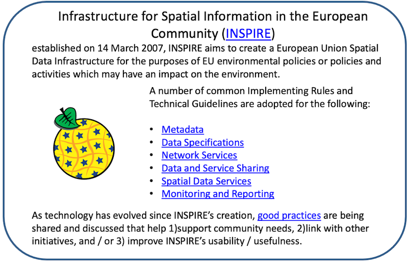

== Achieving Outcomes

|===
| The purpose of this section is enabling the reader to: +
* Understand the importance of how standards will improve sharing and use of geospatial information and optimize geospatial information management. +
* Understand use cases to apply rapid mobilization of new sources of data and technologies and avoid lock-in to specific technology providers. +
* Understand requirements for improved uptake of geospatial information across government and with the private sector and citizens; and creating efficiencies in geospatial data production and lifecycle management, saving effort, time, and cost in reusing and repurposing data. +
* Understand the benefit realization and compliance of standards with the development of indicators to assess, monitor and evaluate as part of an internal/external auditing exercise.
|===

=== Putting it all together

In a perfect world, reading this Guide once would result in a fully informed computer mapping expert. However, the authors will be the first to inform the reader that the path over time is filled with challenges, failures, and victories. Through an iterative process of discovery, and re-discovery, geospatial experts learn, and re-learn, what it takes to achieve a successful outcome. Implementations are often followed by re-imaginations of what works best in a given situation, which often changes by the time everyone comes on board with their efforts and discover what their role should be.

As a result, please consider that each situation is unique, and one must often scramble to make all of the pieces fit. Frustrating, yet normal and expected. Many of the pieces are included above, with the expectation that many readers will be thinking that some aspects do not apply to their situation. However, it is good to know what else is out there, so that one will know to go looking for it when needed, knowing that it exists to be found.

That said, the details of geospatial standards provide the most comprehensive knowledge guideline. They define how everything actually works and fits together to function properly. If one knows how a computer file is structured, or data delivered over a network, or an interface displayed, one can know what to look for when it doesn't function as expected. Many computer experts most often find themselves asking why something doesn't work, and marvel at their good fortune when it does.

Three main aspects of positive outcomes are compliance, success indicators, and role models of success.

=== Compliance

A system of compliance is encouraged to ensure that organizations are implementing the nationally (or internationally) endorsed standards that promote data sharing and use, and to verify that technology products and services acquired by government properly implement the required standards. There are four aspects levels of standards compliance that should be considered:

1. Starting from the beginning, the goal is to achieve regular assessment and validation of organizational compliance in implementing endorsed standards in geospatial information management activities that align with agency, regional and national policy.

2. One main method is the inclusion of nationally endorsed geospatial information management standards as a requirement for all organizational procurements/tenders delivering geospatial technologies and data products and services, with a mandate or preference for delivery of products and services that have been tested and certified as compliant (where such compliance tests are available) with the standard by the appropriate compliance authority.

3. Agency, regional and national policy should include the facilitation of testing and certification functions which can provide formal certification nationally as well as certification recognition under international testing and certification standards, frameworks, and conventions (see about:blank[] https://github.com/opengeospatial/cite/wiki[https://github.com/opengeospatial/cite/wiki].

4. Use of available technology compliance testing resources to confirm proper implementation of standards related to any government developed technologies. SDOs ISO geospatial standards include self-evaluation resources that can be useful. OGC offers freely accessible and offers on-line test procedures and manages certifications.

The http://cite.opengeospatial.org/teamengine/[OGC Compliance Interoperability Test Engine] and ISO 19105 test scripts are available as open source technology, and can be implemented by government organizations for testing of internal government systems which use, or may have been modified to use OGC and ISO standards.

The ISO 19105 standard specifies the framework, concepts and methodology for conformance testing and criteria to be achieved to claim conformance to the family of applicable standards documents regarding geographic information and relevant application domains. It provides a framework for specifying abstract test suites (ATS) composed of abstract test cases grouped in conformance classes and for defining the procedures to be followed during conformance testing. ATS for each individual ISO/TC 211 standard is found in their respective Annex A. Conformance may be claimed for data or software products or services or by specifications including any profile or functional standard.

A Use case for using ISO 19105 and the Abstract test suites for is found \<an external link or reference to the appropriate annex/part of this Guide\>

IHO has a long history of supporting international testing frameworks for certification against global standards supporting the SOLAS convention. These testing and compliance regimes are the result of global harmonization efforts by many national agencies (see: https://iho.int/en/standards-in-force[Standards in Force | IHO])

=== Success Indicators

It is important to have a Benefits Realization Plan and establish success indicators to gauge whether benefits have been realized. Success indicators typically set targets and define how the benefits will be measured, and what evidence will be used as the basis. It is valuable to know when the objective of implementing standards has achieved overarching goal(s), such as enhanced interoperability and data integration.

The benefits of implementing a common standards framework are achieved over time and reinforce the need for a national standards strategy for verifying that implementations had the desired impact in reaching overarching goals and objectives. By implementing geospatial information management systems based on a common, open, standards framework, technological barriers to geospatial information sharing can be significantly minimized.

This allows the decision to share geospatial information among organizations from the local to global level, to be one of policies; regarding open data, as well as data that should be restricted from sharing due to clearly defined privacy or security policies. Without a common standards framework, organizations risk creating technical barriers to data sharing and locking their organizations into a particular technology solution.

When data sharing becomes a requirement in such an environment, costly and time-consuming custom software development is often required to solve data compatibility challenges – raising system lifecycle costs, and more importantly, causing missed opportunities to share and cooperate on urgent, time sensitive issues.

By adopting and implementing a common geospatial information management standards framework across government and with other stakeholders, governments can better assure that geospatial information managed by different organizations can be discovered, accessed, and applied to address a range of important issues. Organizations reduce their IT lifecycle costs and make it easier to add new standards-based capabilities as they are offered by industry.

They also take advantage of the interoperability enabled by the variety of geospatial and IT products and services available on the market that implement these standards, as well as case studies from the user community that illustrate the benefits of adopting international geospatial standards, such as those summarized in this Guide and Appendix 7 Other indicators may include assessing, monitoring and evaluating as part of an internal/external auditing exercise, and may include factors such as:

* Improvements in geospatial data production and management efficiencies that save time and effort.
* Improved ability to share geospatial information with ease under normal operational and urgent situations.
* Cost savings related to the reuse / repurposing of geospatial data.

Examples of Community good practices are provided in IGIF Appendix 6.7. See Interrelated Action for a Benefits Realization Plan (SP3).

=== Standards Training, Tools and Related Resources

A range of training, references and tools are made freely available by the SDOs and other organizations committed to advancing efficient and effective geospatial information management. A few examples are provided below. Readers are encouraged to refer to https://docs.google.com/spreadsheets/d/1fr_qnz47EsDbHyaZatwdHS940QBm4b9nXT7erVg1-nk/edit?usp=sharing[Appendix 8] for a detailed listing of training, tools and other resources.

==== Education / Training

The following are examples online and freely available education and training programs. Please refer to https://docs.google.com/spreadsheets/d/1P9KDa5sts9iH91GXA_lFs-Y2RmvsqACirevFA12460c/edit?usp=sharing[Appendix 8] for additional details on training.

* OGC eLearning modules to understand and implement standards, http://opengeospatial.github.io/e-learning/ogc-standards/text/services-ogc.html[Understanding OGC Standards — OGC e-Learning 2.0.0 documentation (opengeospatial.github.io)]
* European INSPIRE Training Library: https://inspire.ec.europa.eu/portfolio/training-library[https://inspire.ec.europa.eu/portfolio/training-library]
* The ANZLIC Intergovernmental Committee on Surveying and Mapping (ICSM) Metadata Working Group has created a video: https://sho.co/1C95Q[Metadata: What is it, and why is it so important?]
* There are a wide range of FAIR data training resources and courses offered on the internet and by various organizations worldwide. One such example is provided by the http://ardc.edu.au/resources/working-with-data/fair-data/fair-data-training/[Australian Research Data Commons]:
* ESIP provides a comprehensive set of training and tools. http://dmtclearinghouse.esipfed.org/[http://dmtclearinghouse.esipfed.org/]
* https://locationindex.s3-ap-southeast-2.amazonaws.com/DGGS.mp4[Introductory AusPIX DGGS Video]
* https://sho.co/1C95Q[Metadata: What is it, and why is it so important?]

==== Strategic Goals and Planning

IGIF SP1, Strategic Pathway 1 - Governance and Institutions, provides guidance on strategic planning. Since standards are a fundamental aspect of achieving appropriate outcomes, it can be useful to ensure that local strategic plans incorporate standards at the earliest stages. Examples of Strategic Plans:

Examples of Strategic Plans:

* UK Geospatial Commission: http://www.gov.uk/government/publications/unlocking-the-power-of-locationthe-uks-geospatial-strategy[UK Geospatial Strategy]
* US NSDI Strategic Plan
* ISO defined 2030 as a milestone to reflect on our progress and evaluate our fundamental work as an organization. This time frame aligns with the UN's ambitious Global Agenda for 2030, which, as outlined through the 17 Sustainable Development Goals, will require international collaborative effort to become a reality. See: https://www.iso.org/files/live/sites/isoorg/files/store/en/PUB100364.pdf[ISO Strategy 2030]
* https://www.iso.org/files/live/sites/isoorg/files/store/en/PUB100364.pdf[ANZLIC] https://www.iso.org/files/live/sites/isoorg/files/store/en/PUB100364.pdf[Strategy that aligns with and supports global and domestic initiatives.] https://www.iso.org/files/live/sites/isoorg/files/store/en/PUB100364.pdf[] https://www.anzlic.gov.au/anzlic-council/anzlic-strategic-plan-2020-24[https://www.anzlic.gov.au/anzlic-council/anzlic-strategic-plan-2020-24]
* Global Earth Observation System of Systems (GEOSS) developed a strategic plan:https://earthobservations.org/documents/open\_eo\_data/GEO\_Strategic\_Plan\_2016\_2025\_Implementing\_GEOSS.pdf

==== Standards Baseline Surveys / Assessment

* https://www.icsm.gov.au/sites/default/files/2017-07/SIDA-survey.pdf[Developed by ICSM Metadata Working Group]

* https://drive.google.com/file/d/1XuOW74eF_bjoQkLzx1w6IyQKMTs0CPMO/view?usp=sharing[Appendix 2]: Example of a simple metadata Survey to determine adoption of metadata
* Standards Inventory https://iho.int/en/standards-and-specifications[Standards and Specifications | IHO] (refer to https://drive.google.com/file/d/1RsKY_33lVmPKvoppq9BP-BSf0pOPIsZg/view?usp=sharing[Appendix 5])
* Needs Assessment and Gap Analysis Reference IGIF SP6 Appendix 6.3 Table Needs Assessment and Gap Analysis Template
* http://drive.google.com/file/d/1Js3R-OHT_TSXDlzcBwKg3Dir3-1NEq1t/view?usp=sharing[Updating the Australian Geospatial Reference System (AGRS) and Associated Standards]
* Call to Action for Global Access to and https://doi.org/10.5334/dsj-2021-019[Harmonization of Quality Information of Individual Earth Science Datasets]
* https://doi.org/10.31219/osf.io/xsu4p[International Community Guidelines for Sharing and Reusing Quality Information of Individual Earth Science Datasets]

==== A Standards Governance Framework

* Foundation Spatial Data Framework is a change program on Australia's "common asset" of location information. https://www.anzlic.gov.au/resources/foundation-spatial-data-framework[Foundation Spatial Data Framework | ANZLIC].
* OGC (https://www.ogc.org/) and W3C (https://www.w3.org/) are good examples for standards governance framework.

==== Action Plans including Institutional Arrangements

The INSPIRE Directive and its implementation across Europe can be seen as a major use case for geospatial standards. Many of these standards are directly or indirectly referenced to, either in the Directive or its supporting documents and guidelines. The message is geospatial standards support legislation, which support fundamental data (such as INSPIRE data themes), and eventually support SDGs.

* https://inspire.ec.europa.eu/[INSPIRE | Welcome to INSPIRE (europa.eu)]

* Implementation and Communication of Standards http://opengeospatial.github.io/e-learning/ogc-standards/text/services-ogc.html[Understanding OGC Standards — OGC e-Learning 2.0.0 documentation (opengeospatial.github.io)], https://sho.co/1C95Q[Metadata: What is it, and why is it so important ?]
* Standards Review Program http://www.s-121.com/w/index.php/Main_Page[http://www.s-121.com/w/index.php/Main\_Page]
* Standards CoP https://iho.int/en/standards-in-force[https://iho.int/en/standards-in-force]
* Standards Capacity Building Programs

.INSPIRE – A European legislative Directive with technical specifications encouraging the use of open standards

Current Global Navigation Satellite Systems (GNSS) enable existing and emerging industries to use real-time precise positioning data, allowing them to improve productivity, efficiency, safety and decision making. Standards play a crucial role when combining GNSS and geodetic data with data from other domains. https://frontiersi.com.au/wp-content/uploads/2020/11/P1003-Geodetic-Standards-Final-Report.pdf[https://frontiersi.com.au/wp-content/uploads/2020/11/P1003-Geodetic-Standards-]image::UNGGIM_Guide_ED_3_COE_Version_html_17af7daaee918bcb.png["",857,459] https://frontiersi.com.au/wp-content/uploads/2020/11/P1003-Geodetic-Standards-Final-Report.pdf[Final-Report.pdf]

==== Success Indicators for Benefits Realization

What are the indicators for success from which tangle benefits can be assessed? Provided below are case standards implementation case studies showing ROI, cost savings, and new efficiencies benefitting one or more organizations.

* The OGC WaterML 2.0 standard, was developed in a working group organized jointly between OGC and the World Meteorological Organization (WMO). WaterML was implemented to more easily integrate a multitude of hydrologic surface and groundwater observations to improve local to global water resource monitoring. See: https://www.ogc.org/blog/3285[Swimming in Data: OGC's WaterML 2.0 Quenches New Zealand's Thirst for Information Integration | OGC]
* A http://www.linz.govt.nz/system/files_force/media/pages-attachments/New%20Zealand%20Bathymetry%20Investigation%20October%202015.pdf?download=1[Land Information New Zealand Bathymetry Investigation] identified open standards such as metadata and IHO standards as a means of reducing duplication of collection, and to minimize associated outlay of operational funding.
* Within the framework of Mexico's statistical and geographical information system, based on good international practices in standardization, INEGI provides the Technical Regulations for coordination and guidance on statistical and geographical matters. f https://www.snieg.mx/DocumentacionPortal/Normatividad/vigente/nt_ng_frs_feg.pdf[https://www.snieg.mx/DocumentacionPortal/Normatividad/vigente/nt\_ng\_frs\_feg.pdf].
