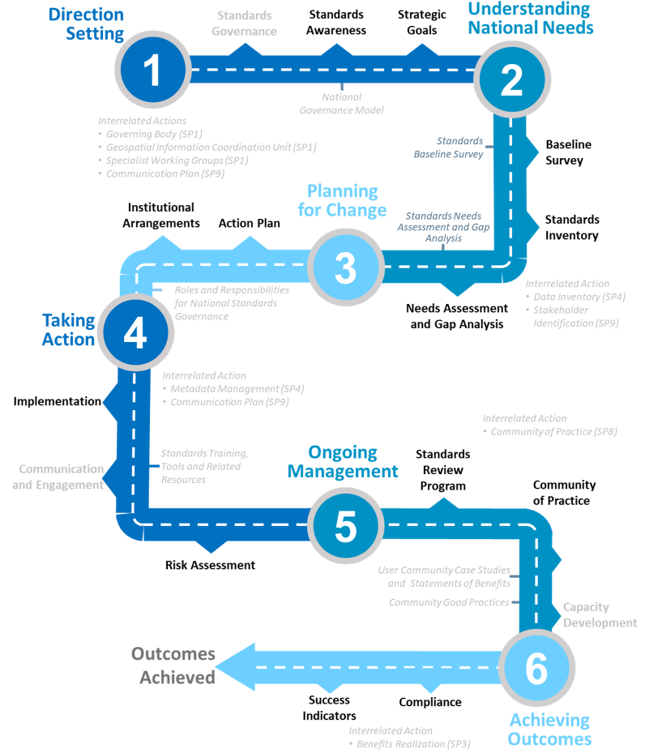

:!numbered:
== Summary

The purpose of this Guide is to promote the recommendations regarding the use of standards for geospatial information management. The Guide complements http://ggim.un.org/IGIF/part2.cshtml[Strategic Pathway 6 on Standards (SP6)] of the http://ggim.un.org/IGIF/[Integrated Geospatial Information Framework (IGIF), window="_blank"] Implementation Guide, providing specific guidance and options to be taken by countries when implementing the IGIF.This Guide and the IGIF have been developed through extensive consultations with experts from around the world working under the auspices of the United Nations Committee of Experts on Global Geospatial Information Management (UN-GGIM).

This Guide provides detailed insights on the standards and good practices necessary to establish and maintain geospatial information management systems that are compatible and interoperable with other systems within and across organizations. The Guide also underscores the importance of standards in facilitating the application of the FAIR (Findable, Accessible, Interoperable, and Reusable) data principles - promoting improved policymaking, decision making and government effectiveness in addressing key social, economic, and environmental topics, including attainment of Sustainable Development Goals.

The Guide addresses different target audiences and the roles they play in performing implementations of standards, while raising awareness of the benefits and costs of engagement:

* *Decision makers* - who need guidance and coordination to understand the benefits of standards and the importance of setting strategic goals to achieve increasing levels of geospatial maturity.
* *Developers of interoperable solutions* - who need working knowledge about what standards are needed and applicable in different cases, as well as methods to access the standards to take the essential steps for implementing geospatial standards and interoperable solutions.
* *Standards users* - who must understand the importance of adhering to standards and to provide feedback into the ongoing use of the implemented standards.
* *Practitioners in the public and private sector and civil society* - who need to know the benefits of working with standardized data, how and why things work the way they do, and can share experiences and standards success stories with others.

While this Guide provides guidance on the benefits of implementing current, broadly implemented standards, it also provides insight on the importance of managing change. Standards must continuously adapt to changes in technology and other developments. On a regular basis, the UN-GGIM reviews and publishes https://ggim.un.org/documents/DRAFT_Future_Trends_report_3rd_edition.pdf[a five to ten year vision on future trends in geospatial information management, window="_blank"] that informs readers of upcoming developments. In the most recent version, the top geospatial industry drivers predicted to have the greatest impact on geospatial information management over the next five to ten years were identified and grouped into five categories: rise of new data sources & analytical methods; technological advancements; evolution of user requirements; industry structural shift; and legislative environment. In terms of the IGIF Strategic Pathways, these drivers are expected to have a significant impact on standardization needs.

This Guide represents the work of individuals around the world who contributed their time and expertise in global cooperation, with the encouragement of their home nations and employers, in some cases on a voluntary basis. As a reader of this document, we invite your participation and contributions as your encouragement plays a crucial role in bringing your nation's and employer's perspectives and insights to the geospatial community. This Guide is intended to be a living document, regularly reviewed and updated. The authors invite you to send your feedback, suggestions, and contributions to mailto:UNStdsGuideComments@lists.ogc.org[UNStdsGuideComments@lists.ogc.org] to help us improve the utility of this Guide.

== Introduction

Geographic information describes phenomena on, above or below the Earth's surface, including naturally occurring phenomena (e.g., rivers, rock formations, coastlines), human-made phenomena (e.g., dams, buildings, radio towers, roads), social phenomena (e.g., political boundaries, electoral districts, population distribution) and transient phenomena (e.g., weather systems). Geographic information is also referred to as geospatial information, geodata, geoinformation, location-based data, or spatial information. Standards facilitate the integration of all kinds of geographic information to enable more effective policies and decision-making. They form part of the architecture by which such information can be discovered, collected, published, shared, stored, combined, and applied. Standards also enable collaborative geospatial information management across organizations and levels of government.

Standards can serve as non-binding policy components to help advance a legal and policy framework for geospatial information management. Adoption of standards by key stakeholders responsible for geospatial information management will have a broad impact across the geospatial ecosystem of a nation, organization, or information community. Standards can be made binding by including them into requests for proposals (RFPs), tenders or contracts. However, standards should be implemented according to the respective needs of a country, organization, or information community.

This Guide complements the IGIF SP6. The IGIF provides a basis and guide for developing, integrating, strengthening, and maximizing geospatial information management and related resources in all countries. In SP6, the focus is on the adoption of standards and compliance mechanisms for enabling data and technology interoperability to deliver integrated geospatial information and to create location-based knowledge. The purpose of this Guide is to promote the effective use of standards and to help users of standards answer the question, "Where do I start?". It has a section for each of the six actions recommended for the initial and early stages of developing and strengthening geospatial information management arrangements in a country, organization, or information community (see <<figureI1,Figure I.1>>).

[#figureI1]
.Actions and tools designed to assist countries to establish good practice standards and compliance mechanisms (Adapted from IGIF SP6)

Furthermore, use cases (case studies), an integral part of this Guide, are introduced in each section of the document, with an expanded list of case studies also provided as an https://docs.google.com/spreadsheets/d/1fr_qnz47EsDbHyaZatwdHS940QBm4b9nXT7erVg1-nk/edit?usp=sharing[Appendix, window="_blank"]. Specific guidance and options are provided for those who want to implement standards adoption and compliance as part of an IGIF.

Even though the IGIF SP6 aims to guide country-specific action plans for standards adoption and compliance in the context of national geospatial information management, this Guide is also useful for other organizations, such as state and provincial governments, private sector, and non-profit organizations. This Guide will help them to understand how their data, services and systems can be seamlessly integrated with national geospatial information and how their products and offerings can achieve the necessary flexibility to innovate and rapidly mobilize new technologies and data sources.

The target audience for this Guide comprises four groups representing the different roles they play in standardization. Each of the groups can be linked to one of the four Elements of Standards in the IGIF/SP6, illustrated in <<tablei.1,Table I.1>>. This Guide was prepared with the aim to be understandable by those who are relatively new to the topic of geospatial standards, as well as those proficient in the use of standards. At the same time, this Guide provides guidance to both high-level policy and decision-makers, as well as implementers of standards.

[#tablei.1]
[caption="Table I.{counter:itable-num} "]
.The four groups of the target audience for this Guide and their relation to the IGIF SP6 Elements of Standards.
[options="header"]
|===
h| *Roles* h| *Link to IGIF/SP6 Element* h| *Required level of understanding standards* h| *Activities* h| *Relation to this Standards Guide*
| Decision makers | Governance and Policy | Can recognize the benefits of standards, in reaching long-term goals | - Set government policy framework- Allocate funding | Secondary target audience
| Developers of interoperable solutions | Technology andData Interoperability | Can implement standards, Can develop & revise standards | - Ensure design meets national needs and challenges- Participate in standards development | Main target audience
| Standards users | Compliance Testing and Certification | Can interpret & use standards | - Participate by expressing needs- Implement internal policy to align with endorsed standards | Target audience
| Practitioners in the public and private sector, and civil society | Community of Practice (CoP) | Can discover & use standards as good practice | - Identify needs for standards contributing to the Sustainable Development Goals (SDGs)- Participate in standards development, adoption, and implementation | Target audience
|===

*Decision makers* are responsible for the governance framework and policy environment that support standards adoption and compliance. They also provide the resources and allocate funding. Decision makers therefore want to understand how the benefits of standards adoption and compliance can be maximized to achieve their strategic goals. This Guide provides examples from a number of countries, information communities or organizations; guidance on how to develop a common framework of national data and technology standards; and guidance on how national requirements can be represented and addressed in the activities of international Standards Development Organizations (SDO). Decision makers can use these examples to guide action plans for achieving optimal outcomes and benefits. After reading the respective section in the Guide, a decision maker will be able to:

* Direction setting: Understand the benefits of standards and the importance of setting strategic goals to achieve increasing levels of geospatial maturity.
* Understanding needs: Understand which standards are available to assess and address an organization's needs based on geospatial maturity level or tier.
* Planning for change: Understand how other nations or organizations have implemented and used standards to meet their needs.
* Taking action: Understand the level of maturity of the nation and/or organization and thereby the level of complexity and the potential work that needs to be done during the implementation phase.
* Ongoing management: Authorize and resource a standards maintenance process essential for maintaining an effective national geospatial information management and sharing environment.
* Achieving outcomes: Understand the importance of how standards will improve sharing and use of geospatial information and optimize geospatial information management

*Developers of interoperable solutions* are the primary target audience for this Guide. They develop and implement technologies so that different systems and diverse data types can work together seamlessly. They may also be involved in the development of standards or profiles that meet the specific needs of their countries or organizations. This Guide provides them with information about the different types of standards, how they facilitate interoperability, how to access standards and how they have been implemented in other countries, information communities and organizations. Developers of interoperable solutions can use this Guide to plan and design their own implementation or development of standards to ensure that they meet the needs and address the challenges of their countries or organizations. After reading the respective section in this Guide, a developer of interoperability will be able to:

* Direction setting: Identify the types of standards required for increasing levels of capability and scale of collaboration and understand the role of SDOs and how to participate in standards development.
* Understanding needs: Understand which standards are available to assess and address an organization's needs based on geospatial maturity level or tier, and understand how standards are evolving along with changing needs and technologies.
* Planning for change: Understand the importance of considering and implementing standards as part of the systems development lifecycle, and the importance of contributing to and providing feedback to the development of standards through direct participation and provision of feedback.
* Taking action: Understand details about what standards are needed and applicable in different cases, how to access the standards, and how to take the essential steps to implement those standards.
* Ongoing management: Understand how to remain current with advancements in standards through periodic review with standards bodies and communities of practice.
* Achieving outcomes: Understand use cases to apply rapid mobilization of new sources of data and technologies and avoid lock-in to specific technology providers.

*Standards users* evaluate and select standards or standards-based products for implementation in their countries or organizations, with the goal of achieving national or organizational goals. They need to understand how a standard achieves interoperability and whether a standards-based product complies and/or is certified to comply with a standard. They want to know the standardization target for a specific standard (e.g., web service or metadata) and the kind of interoperability that can be achieved (e.g., system, structural, syntactic, or semantic). This Guide provides them with information about the different types of standards, how they facilitate interoperability and how compliance to standards is tested and certified. The Guide helps to inform the evaluation approach followed by a standards user to make sure that selected standards or standards-based products meet the needs and address the challenges of their countries, organizations, or information communities. Each section provides standards users with specific insight into an effective implementation strategy:

* Direction Setting: Understand the different types of standards and how they contribute to interoperability and generate benefits.
* Understanding Needs: Understand which standards are available to assess and address an organization's needs based on geospatial maturity level or tier, and understanding how standards are evolving along with changing needs and technologies.
* Planning for change: Understand the types of business needs that may be supported through the implementation of standards, advocating for the adoption of standards to facilitate interoperability and other efficiencies, and understand the importance of considering and implementing standards as part of the systems development lifecycle, and the importance of contributing to and providing feedback to the development of standards through direct participation and provision of feedback.
* Taking action: Match the standards required to fulfill their needs to a given maturity level.
* Ongoing management: Discuss, identify, and submit requirements for standards to address interoperability issues through standards bodies at the organizational, national, and international levels.
* Achieving outcomes: Understand requirements for improved uptake of geospatial information across government and with the private sector and citizens; and creating efficiencies in geospatial data production and lifecycle management; saving effort, time, and cost in reusing and repurposing data.

*Practitioners* in the public and private sector and civil society are often represented in different communities of practice, groups of people with a shared interest in standards who actively participate in the development, adoption, implementation and/or use of standards. A community realizes the benefits of standards and interoperability by sharing and leveraging proven standards-based good practices and training material specific to their community's needs. A Community of Practice (CoP) can also provide commonality across diverse uses and levels of operation, and help promote consistent, sharable training and educational programs. This Guide provides communities of practice with an overview of standards and standardization and suggests domain and technology trends expected to be standardized in the future. CoPs can use this Guide to inform and plan contributions to standards development, adoption and implementation of standards, and development of training material and educational programs. It can also serve to identify a community's standardization needs that are not yet addressed. After reading the respective section in this Guide, members of a CoP will be able to:

* Direction setting: Understand the different types of standards and how they contribute to interoperability and generate benefits.
* Understanding needs: Understand which standards are available to assess and address an organization's needs based on geospatial maturity level or tier.
* Planning for change: Understand how they can play a role in the identification of opportunities for standardization in the context of their domain, act as advocates to engage related communities of practice to facilitate alignment and interoperability at various levels.
* Taking action: Understand the standards and provide feedback into the ongoing development of the implemented standards.
* Ongoing management: Understand how they can share experiences and standards success stories with others.
* Achieving outcomes: Understand the benefit realization and compliance of standards with the development of indicators to assess, monitor and evaluate as part of an internal/external auditing exercise.
