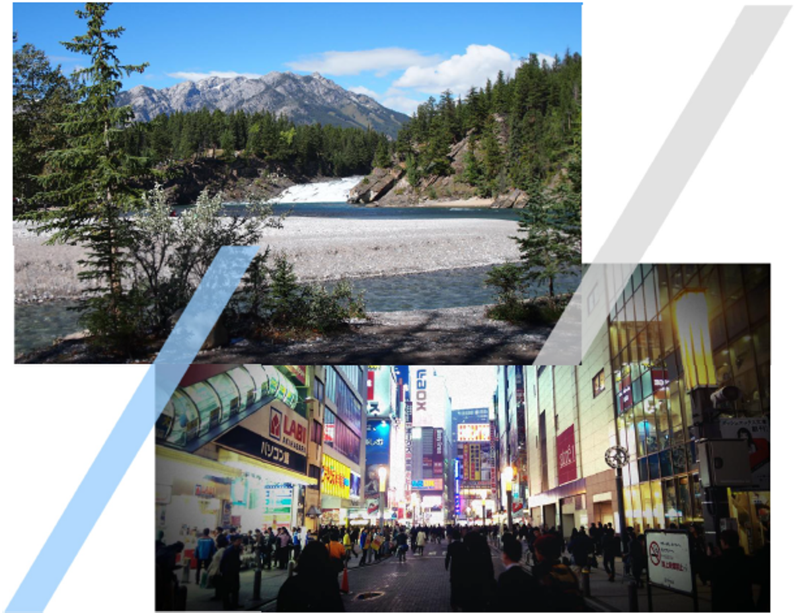

[separator=::]
= A Guide to the Role of Standards in Geospatial Information Management

== Companion document on Standards Recommendations by Tier

:stem:
:doctype: article
:encoding: utf-8
:lang: en

:toc: macro
:toc-placement: manual
:toclevels: 2
:numbered:
:sectanchors:
// set media to output format print or screen for pdf export
:media: print
:sectnums:
:sectnumlevels: 5

Edition 3 Draft, Review/comments invited by 31 October 2021, +
mailto:UNStdsGuideComments@lists.ogc.org[UNStdsGuideComments@lists.ogc.org]

<<<<

toc::[]

<<<<

include::intro.adoc[]
include::clause_1.adoc[]
include::clause_2.adoc[]
include::clause_3.adoc[]
include::clause_4.adoc[]
include::clause_5.adoc[]
include::clause_6.adoc[]

////
[[sdfootnote1]]

[[sdfootnote1sym]]UN GGIM Integrated Geospatial Information Framework (IGIF) - Strategic Pathway 6 (SP6), http://ggim.un.org/IGIF/part2.cshtml[http://ggim.un.org/IGIF/part2.cshtml]

[[sdfootnote2]]

[[sdfootnote2sym]] What is Interoperability? https://www.himss.org/resources/interoperability-healthcare[https://www.himss.org/resources/interoperability-healthcare]

[[sdfootnote3]]

[[sdfootnote3sym]] http://tsapps.nist.gov/publication/get_pdf.cfm?pub_id=101300[http://tsapps.nist.gov/publication/get\_pdf.cfm?pub\_id=101300]

[[sdfootnote4]]

[[sdfootnote4sym]] adapted from https://www.usgs.gov/core-science-systems/ngp/ss/product-standards[https://www.usgs.gov/core-science-systems/ngp/ss/product-standards]

[[sdfootnote5]]

[[sdfootnote5sym]] Open does not necessarily imply free of cost. Depending on a SDO's business model, costs of developing standards are recovered from membership fees or sales.

[[sdfootnote6]]

[[sdfootnote6sym]] Specifications may be industry or community developed. Industry-driven specifications typically start as closed or proprietary based on their intellectual property value and a company's investment in research and development. Some owners of closed specifications make open libraries available for others to read and right, providing a level of openness. As specifications mature, some are released through open licenses to the community as open specifications. Some International and Community standards begin as industry developed open specifications and de facto standards.

[[sdfootnote7]]

[[sdfootnote7sym]] A Community standard is an official position of the OGC endorsing a specification or standard developed external to the OGC and is considered a normative standard by OGC membership and part of the OGC Standards Baseline. Examples of open specifications that have achieved OGC Community Standard status include the _OGC 3D Tiles Specification_ and _OGC Indexed 3d Scene Layer (I3S) and Scene Layer Package Format Specification_. https://www.ogc.org/standards/community[https://www.ogc.org/standards/community]

[[sdfootnote8]]

[[sdfootnote8sym]] Examples of endorsed Good Practices include the Defence Geospatial Information Working Group (DGIWG) Comm/TIFF Profile for Imagery & Gridded Data 2.3.1 (OGC Best Practices https://www.ogc.org/docs/bp ) and INSPIRE Good Practice: SDMX for Human Health and Population Distribution (INSPIRE Good Practices https://inspire.ec.europa.eu/portfolio/good-practice-library )

[[sdfootnote9]]

[[sdfootnote9sym]] De facto standards can be endorsed as international standards over time, for example, _HTML, PDF_, and _GeoJSON_ have followed this route https://whatis.techtarget.com/definition/de-facto-standard[https://whatis.techtarget.com/definition/de-facto-standard] and https://www.ogc.org/blog/2543[https://www.ogc.org/blog/2543]

[[sdfootnote10]]

[[sdfootnote10sym]]See DIN, ""Economic Benefits of Standardization," 2010, at http://www.din.de/sixcms_upload/media/2896/DIN_GNN_2011_engl_akt_neu.pdf[http://www.din.de/sixcms\_upload/media/2896/DIN\_GNN\_2011\_engl\_akt\_neu.pdf]

[[sdfootnote11]]

[[sdfootnote11sym]]See Craglia M. (Ed.), "The Socio-Economic Impact of the Spatial Data Infrastructure of Catalonia," 2008, at http://publications.jrc.ec.europa.eu/repository/handle/111111111/7696[http://publications.jrc.ec.europa.eu/repository/handle/111111111/7696]

[[sdfootnote12]]

[[sdfootnote12sym]]NASA Geospatial Interoperability Return on Investment Study (2005) http://www.ec-gis.org/sdi/ws/costbenefit2006/reference/ROI_Study.pdf[http://www.ec-] http://www.ec-gis.org/sdi/ws/costbenefit2006/reference/ROI_Study.pdf[gis.org/sdi/ws/costbenefit2006/reference/ROI\_Study.pdf]

[[sdfootnote13]]

[[sdfootnote13sym]]New Zealand http://www.linz.govt.nz/geospatial-office/about/projects-and-news/productivityreport[http://www.linz.govt.nz/geospatial-office/about/projects-and-news/productivityreport]

[[sdfootnote14]]

[[sdfootnote14sym]] A profile may be a locally recommended subset of a standard and/or locally relevant domain lists to be used with a particular standard, such as a list of metadata keywords.

[[sdfootnote15]]

[[sdfootnote15sym]] The reference model for geographic information standardization (ISO 19101-1, Geographic information -- Reference model -- Part 1: Fundamentals, also available as the OGC Abstract Specification)

[[sdfootnote16]]

[[sdfootnote16sym]] ISO 19101-1:2014, Geographic information -- Reference model -- Part 1: Fundamentals

[[sdfootnote17]]

[[sdfootnote17sym]] UN GGIM Integrated Geospatial Information Framework (IGIF) - Strategic Pathway 6 (SP6)

[[sdfootnote18]]

[[sdfootnote18sym]]For examples of 'Foundation' see ANZLIC Australian and New Zealand Foundation Spatial Data Framework http://www.anzlic.gov.au/foundation_spatial_data_framework[http://www.anzlic.gov.au/foundation\_spatial\_data\_framework] http://www.anzlic.gov.au/foundation_spatial_data_framework[.]For examples of 'Framework' - See US Federal Geographic Data Committee Framework, https://www.fgdc.gov/framework/handbook/overview[https://www.fgdc.gov/framework/handbook/overview]

[[sdfootnote19]]

[[sdfootnote19sym]]Refer to ISO Standard "19110:2016 Geographic information — Methodology for feature cataloguing" for more information

[[sdfootnote20]]

[[sdfootnote20sym]]See also ISO Standard "ISO 25964-1 Information and documentation - Thesauri and interoperability with other vocabularies". In particular, ISO 25964-2 describes the W3C recommendation SKOS, the Simple Knowledge Organization System.

[[sdfootnote21]]

[[sdfootnote21sym]] More information can be found online at the Data Interoperability Standards Consortium http://datainteroperability.org/[http://datainteroperability.org/]

[[sdfootnote22]]

[[sdfootnote22sym]] www.ogc.org/roadmap

[[sdfootnote23]]

[[sdfootnote23sym]] Further, https://de.wikipedia.org/wiki/MQTT[MQTT] is becoming increasingly popular in the IoT universe.

[[sdfootnote24]]

[[sdfootnote24sym]] https://www.ogc.org/standards/community[https://www.ogc.org/standards/community].

[[sdfootnote25]]

[[sdfootnote25sym]]See http://www.onegeology.org/technical_progress/technical.html[] http://www.onegeology.org/technical_progress/technical.html[http://www.onegeology.org/technical\_progress/technical.html]

Edition 3 Draft, Review/comments invited by 31 October 2021, mailto:UNStdsGuideComments@lists.ogc.org[UNStdsGuideComments@lists.ogc.org]
////
